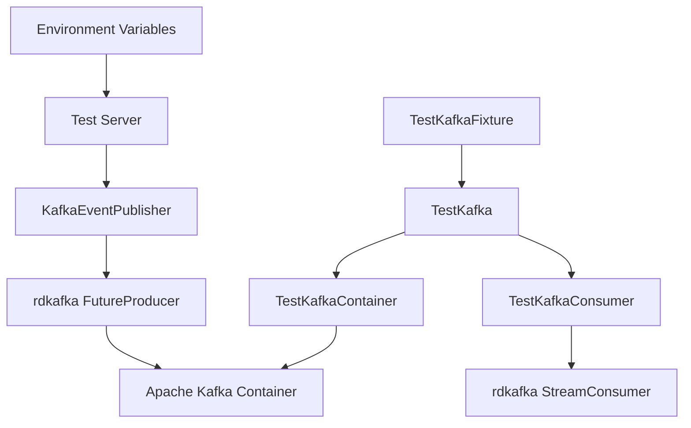

# Kafka Event Testing Guide

## Overview

This guide explains our comprehensive approach to testing Kafka event publishing in the IAM service. Our testing strategy ensures reliable event publishing while maintaining fast, isolated tests that can run in any environment.

## Testing Philosophy

### Design Principles

1. **Real Integration Testing**: Use actual Kafka containers instead of mocks for integration tests
2. **Fail-Safe Testing**: Ensure business operations continue even when Kafka is unavailable
3. **Environment Isolation**: Tests should not interfere with each other or external systems
4. **Fast Feedback**: Quick test execution with proper cleanup
5. **Production Parity**: Test configuration should mirror production setup

### Testing Pyramid

```
┌─────────────────────────────────────┐
│     Integration Tests (E2E)        │  ← Real Kafka containers
│  test_signup_kafka_integration     │     Full event flow
└─────────────────────────────────────┘
┌─────────────────────────────────────┐
│       Unit Tests                   │  ← Event serialization
│  test_event_serialization          │     Configuration validation
│  test_kafka_config_creation        │     Error handling
└─────────────────────────────────────┘
```

## Implementation Choices

### 1. Testcontainers vs Mock Kafka

**Choice: Real Kafka with Testcontainers**

**Rationale:**
- **Real Integration**: Catches actual Kafka connectivity issues
- **Producer/Consumer Compatibility**: Tests real rdkafka behavior
- **Configuration Validation**: Verifies actual Kafka configuration
- **Network Behavior**: Tests timeout handling, retries, etc.

**Alternative Considered:**
```rust
// ❌ Mock approach (rejected)
struct MockKafkaProducer {
    published_events: Vec<DomainEvent>,
}

// ✅ Real container approach (chosen)
let kafka_container = GenericImage::new("apache/kafka", "3.7.0")
    .with_env_var("KAFKA_PROCESS_ROLES", "broker,controller")
    .start().await?;
```

**Why Not Mocks:**
- Miss real-world integration issues
- Don't test actual rdkafka producer behavior
- Can't validate Kafka-specific configuration
- Don't catch serialization issues with real Kafka

### 2. Kafka Distribution Choice

**Choice: Apache Kafka 3.7.0 in KRaft Mode**

**Rationale:**
- **No Zookeeper**: Simplified setup, faster startup
- **Production Parity**: Matches modern Kafka deployments
- **Reliability**: KRaft mode is production-ready since Kafka 3.3
- **Performance**: Faster container startup and teardown

```rust
let kafka_image = GenericImage::new("apache/kafka", "3.7.0")
    .with_env_var("KAFKA_NODE_ID", "1")
    .with_env_var("KAFKA_PROCESS_ROLES", "broker,controller")
    .with_env_var("KAFKA_CONTROLLER_QUORUM_VOTERS", "1@localhost:29093")
    // No Zookeeper needed
```

### 3. Port Management Strategy

**Choice: Configuration-Integrated Random Port Allocation**

**Rationale:**
- **Parallel Test Execution**: Multiple tests can run simultaneously
- **CI/CD Compatibility**: No port conflicts in build environments
- **Configuration Consistency**: Uses same port resolution as database
- **Cache Coordination**: Ensures consistent port usage across test lifecycle

```rust
// Load test configuration
let config = infra::config::load_config()?;
let kafka_config = &config.kafka;

// Use configuration's port resolution (handles port = 0)
let kafka_port = kafka_config.actual_port();
```

**Previous Approach (Manual Random Ports):**
```rust
// ❌ Old approach (replaced)
fn get_random_port() -> u16 {
    let listener = TcpListener::bind("127.0.0.1:0").unwrap();
    let port = listener.local_addr().unwrap().port();
    drop(listener);
    port
}
```

**New Approach (Configuration-Integrated):**
```rust
// ✅ New approach (current)
// In config/test.toml:
// [kafka]
// port = 0  # Triggers random port allocation

// In test code:
let kafka_port = kafka_config.actual_port(); // Cached random port
```

### 4. Container Lifecycle Management

**Choice: Global Singleton Container with Configuration Integration**

**Rationale:**
- **Performance**: Avoid container startup overhead per test
- **Resource Efficiency**: Single container for all tests in a file
- **Configuration Coordination**: Integrates with configuration cache system
- **Proper Cleanup**: Reference counting ensures cleanup when done

```rust
static TEST_KAFKA_CONTAINER: OnceLock<Arc<Mutex<Option<Arc<TestKafkaContainer>>>>> = OnceLock::new();

// Clear configuration caches for fresh port generation
infra::config::clear_all_caches();

// Load test configuration
let config = infra::config::load_config()?;
let kafka_config = &config.kafka;

// Use configuration's port resolution
let kafka_port = kafka_config.actual_port();
```

### 5. Configuration Override Strategy

**Choice: Structured Environment Variable Injection**

**Rationale:**
- **No Config File Changes**: Tests don't modify persistent configuration
- **Structured Configuration**: Uses same host/port format as database
- **Runtime Override**: Configuration system picks up environment variables
- **Isolation**: Each test gets its own configuration context

**Old Format:**
```rust
// ❌ Old approach (deprecated)
unsafe {
    std::env::set_var("IAM_KAFKA__BROKERS", &brokers);
}
```

**New Format:**
```rust
// ✅ New approach (current)
unsafe {
    std::env::set_var("IAM_KAFKA__HOST", host);
    std::env::set_var("IAM_KAFKA__PORT", port);
    std::env::set_var("IAM_KAFKA__ENABLED", "true");
    std::env::set_var("IAM_KAFKA__USER_EVENTS_TOPIC", &topic);
}
```

## Test Architecture

### Test Infrastructure Components



### Key Components

#### 1. TestKafkaFixture
**Location:** `tests/common/kafka_testcontainer.rs`

**Purpose:** High-level test fixture providing Kafka integration

**Features:**
- Container lifecycle management
- Environment variable setup
- Event verification utilities

```rust
pub struct TestKafkaFixture {
    pub kafka: TestKafka,
}

impl TestKafkaFixture {
    pub async fn new() -> Result<Self, Box<dyn std::error::Error>> {
        let kafka = TestKafka::new().await?;
        Ok(Self { kafka })
    }
}
```

#### 2. TestKafka
**Purpose:** Core Kafka testing functionality

**Features:**
- Container creation and management
- Message consumption utilities
- Topic configuration

```rust
pub struct TestKafka {
    pub brokers: String,
    pub topic: String,
}
```

#### 3. TestKafkaConsumer
**Location:** `infra/src/event/mod.rs` (test-utils feature)

**Purpose:** Kafka message consumption for test verification

**Features:**
- Event consumption from test topics
- Timeout handling for reliable tests
- Message count verification

```rust
pub struct TestKafkaConsumer {
    consumer: StreamConsumer,
    topic: String,
}
```

## Test Implementation Details

### End-to-End Integration Test

**Location:** `tests/auth_email_password.rs::test_signup_kafka_integration`

**Flow:**
1. **Setup Phase**
   - Start Kafka testcontainer
   - Configure environment variables
   - Start IAM service with Kafka enabled

2. **Action Phase**
   - Perform user signup via HTTP API
   - Verify signup succeeds (201 Created)

3. **Verification Phase**
   - Consume messages from Kafka topic
   - Verify event structure and content
   - Validate event data matches signup

4. **Cleanup Phase**
   - Container cleanup handled automatically
   - Environment variables cleared

### Configuration Testing

**Approach:** Test various Kafka configurations

```rust
#[test]
fn test_kafka_config_creation() {
    let config = KafkaConfig {
        enabled: true,
        brokers: "localhost:9092".to_string(),
        user_events_topic: "test-topic".to_string(),
        // ... other config
    };

    // Test both success and failure scenarios
    let result = KafkaEventPublisher::new(config);
    // Verify behavior based on environment
}
```

### Serialization Testing

**Approach:** Verify event JSON structure

```rust
#[test]
fn test_event_serialization() {
    let event = DomainEvent::UserSignedUp(UserSignedUpEvent::new(
        Uuid::new_v4(),
        "test@example.com".to_string(),
        "testuser".to_string(),
        false,
    ));

    let serialized = publisher.serialize_event(&event);
    assert!(serialized.is_ok());
    
    let json = serialized.unwrap();
    assert!(json.contains("UserSignedUp"));
    assert!(json.contains("test@example.com"));
}
```

## Consumer Implementation

### Test Consumer Design

**Purpose:** Verify events are published correctly

**Key Features:**
- **Unique consumer groups** to avoid conflicts
- **Timeout handling** for reliable test completion
- **Message counting** for verification
- **Error handling** for robust tests

```rust
impl TestKafkaConsumer {
    pub async fn new(brokers: &str, topic: &str) -> Result<Self, Box<dyn std::error::Error>> {
        let consumer: StreamConsumer = ClientConfig::new()
            .set("group.id", &format!("test-consumer-{}", Uuid::new_v4()))
            .set("bootstrap.servers", brokers)
            .set("auto.offset.reset", "earliest")
            .set("enable.auto.commit", "false")
            .create()?;

        consumer.subscribe(&[topic])?;
        tokio::time::sleep(Duration::from_millis(500)).await; // Subscription time
        
        Ok(Self { consumer, topic: topic.to_string() })
    }
}
```

### Message Consumption Strategy

**Approach:** Polling with timeout and retry logic

```rust
pub async fn get_all_messages(&self, max_wait_secs: u64) -> Result<Vec<String>, Box<dyn std::error::Error>> {
    let mut messages = Vec::new();
    let timeout = Duration::from_secs(max_wait_secs);
    let start_time = std::time::Instant::now();
    
    let mut consecutive_timeouts = 0;
    const MAX_CONSECUTIVE_TIMEOUTS: u32 = 3;

    while start_time.elapsed() < timeout && consecutive_timeouts < MAX_CONSECUTIVE_TIMEOUTS {
        match tokio::time::timeout(Duration::from_millis(1000), self.consumer.recv()).await {
            Ok(Ok(m)) => {
                consecutive_timeouts = 0;
                if let Some(payload) = m.payload() {
                    let message_str = String::from_utf8_lossy(payload).to_string();
                    messages.push(message_str);
                    // Commit message
                    self.consumer.commit_message(&m, rdkafka::consumer::CommitMode::Sync)?;
                }
            }
            Ok(Err(e)) => {
                consecutive_timeouts += 1;
            }
            Err(_) => {
                consecutive_timeouts += 1; // Timeout on recv()
            }
        }
        tokio::time::sleep(Duration::from_millis(50)).await;
    }

    Ok(messages)
}
```

## Event Verification

### Event Structure Validation

**Approach:** Parse JSON and validate structure

```rust
// Verify event structure
if let Ok(event) = serde_json::from_str::<serde_json::Value>(message) {
    if let Some(event_type) = event.get("event_type") {
        if event_type == "UserSignedUp" {
            // Verify required fields
            assert!(event.get("event_id").is_some(), "Should have event_id");
            assert!(event.get("user_id").is_some(), "Should have user_id");
            assert!(event.get("occurred_at").is_some(), "Should have occurred_at");
            
            // Verify event data matches
            if let Some(email) = event.get("email") {
                assert_eq!(email.as_str().unwrap(), test_email);
            }
            if let Some(username) = event.get("username") {
                assert_eq!(username.as_str().unwrap(), test_username);
            }
        }
    }
}
```

### Data Validation Strategy

**Approach:** Validate both structure and content

1. **Structure Validation**
   - Required fields present
   - Correct data types
   - Valid JSON format

2. **Content Validation**
   - Field values match input data
   - Event ID is valid UUID
   - Timestamp is reasonable

3. **Business Logic Validation**
   - Email verification status correct
   - User ID matches created user
   - Event type matches action

## Error Handling in Tests

### Graceful Degradation Testing

**Purpose:** Verify system continues working when Kafka fails

```rust
#[test]
async fn test_signup_continues_when_kafka_unavailable() {
    // Don't start Kafka container
    let base_url = get_test_server().await.unwrap();
    
    // Signup should still work
    let response = client.post(&format!("{}/api/auth/signup", base_url))
        .json(&signup_data)
        .send()
        .await
        .unwrap();
    
    // Should return 201 even without Kafka
    assert_eq!(response.status(), 201);
    
    // Event should be handled by no-op publisher
    // Business logic should continue normally
}
```

### Configuration Error Testing

**Purpose:** Verify proper error handling for invalid config

```rust
#[test]
fn test_invalid_kafka_config() {
    let config = KafkaConfig {
        enabled: true,
        brokers: "invalid:99999".to_string(), // Invalid broker
        // ... other config
    };

    let result = KafkaEventPublisher::new(config);
    
    // Should handle error gracefully
    match result {
        Ok(_) => panic!("Should fail with invalid broker"),
        Err(e) => {
            assert!(e.to_string().contains("Failed to create Kafka producer"));
        }
    }
}
```

## Running Tests

### Individual Test Execution

```bash
# Run Kafka integration test
cargo test test_signup_kafka_integration -- --nocapture

# Run with specific log level
RUST_LOG=debug cargo test test_signup_kafka_integration -- --nocapture

# Run in test environment
RUN_ENV=test cargo test test_signup_kafka_integration
```

### CI/CD Considerations

**Docker Requirements:**
- Tests require Docker to be available
- Testcontainers will pull Apache Kafka image
- Sufficient memory for Kafka container

**Environment Setup:**
```yaml
# GitHub Actions example
- name: Setup Docker
  uses: docker/setup-buildx-action@v2

- name: Run Kafka Tests
  run: |
    export RUN_ENV=test
    cargo test test_signup_kafka_integration -- --nocapture
  timeout-minutes: 10
```

## Best Practices

### 1. Test Isolation

**Ensure each test is independent:**
- Use unique consumer group IDs
- Clear environment variables after tests
- Proper container cleanup

### 2. Timeout Management

**Set appropriate timeouts:**
- Container startup: 30 seconds
- Message consumption: 3-10 seconds
- Overall test: < 30 seconds

### 3. Error Verification

**Test both success and failure paths:**
- Valid configurations
- Invalid configurations
- Network failures
- Timeout scenarios

### 4. Resource Management

**Efficient resource usage:**
- Reuse containers when possible
- Proper cleanup on test completion
- Memory-efficient message consumption

### 5. Debugging Support

**Make tests debuggable:**
- Comprehensive logging
- Clear error messages
- Useful debugging output

```rust
println!("🔧 Kafka container started on: {}", kafka_fixture.kafka.brokers);
println!("📊 Found {} total messages", all_messages.len());
for (i, msg) in all_messages.iter().enumerate() {
    println!("📝 Message {}: {}", i + 1, msg);
}
```

## Troubleshooting

### Common Issues

#### 1. Container Startup Failures

**Symptoms:** Tests fail with container creation errors

**Solutions:**
- Ensure Docker is running
- Check available memory (Kafka needs ~512MB)
- Verify network connectivity

#### 2. Consumer Timeout Issues

**Symptoms:** Test fails with "No messages found"

**Solutions:**
- Check producer configuration
- Verify topic name matches
- Increase consumer timeout
- Check Kafka container logs

#### 3. Port Conflicts

**Symptoms:** Address already in use errors

**Solutions:**
- Use dynamic port allocation
- Clean up previous containers
- Check for port leaks

#### 4. Message Parsing Failures

**Symptoms:** Event verification fails

**Solutions:**
- Check event serialization format
- Verify JSON structure matches expected
- Check for event type case sensitivity

### Debug Commands

```bash
# Check running containers
docker ps | grep kafka

# View Kafka logs
docker logs <kafka-container-id>

# Check topics
docker exec <kafka-container-id> kafka-topics.sh --list --bootstrap-server localhost:9092

# Manual message consumption
docker exec <kafka-container-id> kafka-console-consumer.sh \
  --bootstrap-server localhost:9092 \
  --topic test-user-events \
  --from-beginning
```

## Future Improvements

### Potential Enhancements

1. **Schema Registry Integration**
   - Add Avro schema validation
   - Schema evolution testing

2. **Multi-Broker Testing**
   - Test with Kafka cluster
   - Partition assignment verification

3. **Performance Testing**
   - Load testing with high message volume
   - Latency measurement

4. **Security Testing**
   - SSL/TLS configuration testing
   - SASL authentication verification

5. **Dead Letter Queue Testing**
   - Failed event handling
   - Retry mechanism validation

### Implementation Roadmap

1. **Phase 1**: Current implementation (✅ Complete)
   - Basic integration testing
   - Single broker setup
   - Event structure validation

2. **Phase 2**: Enhanced testing
   - Multi-consumer testing
   - Performance benchmarks
   - Security configuration tests

3. **Phase 3**: Production readiness
   - Chaos engineering tests
   - Monitoring integration
   - Advanced error scenarios

## Conclusion

Our Kafka event testing approach provides:

- **Comprehensive Coverage**: From unit tests to full integration
- **Real-World Validation**: Using actual Kafka containers
- **Developer Experience**: Fast, reliable tests with good debugging
- **Production Confidence**: Tests mirror production scenarios
- **Maintainability**: Clear, well-documented test infrastructure

This testing strategy ensures that our Kafka integration is robust, reliable, and ready for production use while maintaining developer productivity and CI/CD efficiency. 