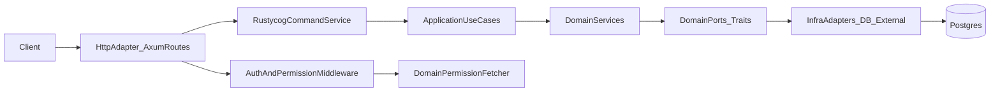

# Implementing a Hexagonal Rust Web Service with `rustycog-*` (Manifesto Blueprint)

This guide shows how to build a hexagonal web service using `rustycog-*`, with `Manifesto` as the concrete reference implementation.

It is intentionally implementation-first: scaffold order, wiring order, and the exact integration seams between HTTP, application, domain, and infrastructure.

## 1) When to Use This Stack

Use this stack when you want:

- strict domain boundaries (ports in domain, adapters in infra),
- command-driven use cases behind a consistent execution service,
- built-in HTTP concerns (auth, permission middleware, validation, tracing),
- composable startup wiring with clear dependency injection,
- repeatable test setup for endpoint-level integration tests.

Core crates commonly used:

- `rustycog-http`
- `rustycog-command`
- `rustycog-db`
- `rustycog-config`
- `rustycog-permission`
- `rustycog-core`
- optional: `rustycog-events`

## 2) Architecture Contract (Hexagonal)

Dependency direction:



Rules you should enforce:

1. Domain defines interfaces (ports), never database clients or HTTP client details.
2. Infrastructure implements domain ports.
3. Application orchestrates domain services through commands/use cases.
4. HTTP handlers stay thin: parse request, build command, execute, map error.
5. `setup` is the composition root where concrete dependencies are wired.

## 3) Reference File Map from Manifesto

Use these files as your baseline patterns:

- Startup entrypoint: `Manifesto/src/main.rs`
- Composition root: `Manifesto/setup/src/app.rs`
- Route wiring and middleware chain: `Manifesto/http/src/lib.rs`
- Handler pattern: `Manifesto/http/src/handlers/members.rs`
- Command registry assembly: `Manifesto/application/src/command/factory.rs`
- Domain ports: `Manifesto/domain/src/port/repository.rs`
- Infra adapter example: `Manifesto/infra/src/repository/resource_repository.rs`
- Permission fetchers: `Manifesto/domain/src/service/permission_fetcher_service.rs`
- Permission middleware behavior: `rustycog/rustycog-http/src/middleware_permission.rs`
- RouteBuilder/app state internals: `rustycog/rustycog-http/src/builder.rs`
- Command types/context/errors: `rustycog/rustycog-command/src/lib.rs`
- Test config profile: `Manifesto/config/test.toml`
- Endpoint integration tests: `Manifesto/tests/member_api_tests.rs`

## 4) Scaffold Blueprint (Build Order)

Follow this order to avoid circular wiring and rework.

### Step 1: Create Layered Crates/Modules

At minimum, mirror these boundaries:

- `domain` (entities, value objects, ports, domain services)
- `application` (use cases, commands, command handlers, DTOs)
- `infra` (database repositories, external service adapters)
- `http` (routes, handlers, HTTP error mapping)
- `setup` (dependency wiring and app state creation)
- `configuration` (typed config loading)
- `migration` (schema migrations + seed data)
- `tests` (integration tests and fixtures)

### Step 2: Define Domain Ports First

In `domain`, define repository traits by read/write concerns, then aggregate trait aliases.

Pattern from Manifesto:

```rust
#[async_trait]
pub trait ProjectReadRepository: Send + Sync {
    async fn find_by_id(&self, id: &Uuid) -> Result<Option<Project>, DomainError>;
}

#[async_trait]
pub trait ProjectWriteRepository: Send + Sync {
    async fn save(&self, project: &Project) -> Result<Project, DomainError>;
}

pub trait ProjectRepository: ProjectReadRepository + ProjectWriteRepository + Send + Sync {}
```

Why this matters: domain behavior can be tested and evolved without infrastructure coupling.

### Step 3: Implement Domain Services Against Ports

Domain services should only depend on trait objects (`Arc<dyn PortTrait>`), not concrete repositories.

Also define permission fetchers in domain if permissions depend on domain rules (membership, project visibility, ownership).

Manifesto pattern:

- `ProjectPermissionFetcher`
- `MemberPermissionFetcher`
- `ComponentPermissionFetcher`

All implement `rustycog_permission::PermissionsFetcher`.

### Step 4: Add Application Use Cases + Commands

Use `rustycog-command` abstractions:

- command structs implementing `Command`,
- handlers implementing `CommandHandler<C>`,
- command registry built by a factory.

Minimal command shape:

```rust
#[async_trait]
impl Command for CreateThingCommand {
    type Result = ThingResponse;

    fn command_type(&self) -> &'static str { "create_thing" }
    fn command_id(&self) -> Uuid { self.command_id }
    fn validate(&self) -> Result<(), CommandError> { Ok(()) }
}
```

Then register handlers centrally (Manifesto uses `ManifestoCommandRegistryFactory`) and wrap in:

- `GenericCommandService::new(Arc<CommandRegistry>)`

### Step 5: Implement Infrastructure Adapters

Implement each domain port in `infra`.

Manifesto uses a clean split:

- `*ReadRepositoryImpl` (read connection)
- `*WriteRepositoryImpl` (write connection)
- `*RepositoryImpl` aggregator delegating to read/write implementations

This is wired from `DbConnectionPool` (`rustycog-db`) in `setup`.

### Step 6: Wire Composition Root in `setup`

`setup/src/app.rs` is the most important file. Wire in this sequence:

1. Load config (already done by caller).
2. Create DB pool (`DbConnectionPool::new`).
3. Create optional event publisher (`rustycog-events`) if needed.
4. Build repositories (infra).
5. Build domain services and permission fetchers.
6. Build use cases.
7. Build command registry and `GenericCommandService`.
8. Build `UserIdExtractor`.
9. Build `AppState`.
10. Start routes via `create_app_routes`.

This keeps all concrete dependency knowledge in one place.

### Step 7: Build HTTP Adapter with `RouteBuilder`

Route pattern in Manifesto:

```rust
RouteBuilder::new(state)
    .health_check()
    .permissions_dir(PathBuf::from("resources/permissions"))
    .resource("project")
    .with_permission_fetcher(project_permission_fetcher)
    .get("/api/projects/{project_id}", get_project)
        .might_be_authenticated()
    .post("/api/projects", create_project)
        .authenticated()
    .put("/api/projects/{project_id}", update_project)
        .authenticated()
        .with_permission(Permission::Write)
    .build(config)
    .await?;
```

Middleware behavior to remember:

- `.authenticated()` applies auth middleware for the current route.
- `.might_be_authenticated()` applies optional auth middleware.
- `.with_permission(...)` applies permission middleware using the current resource + fetcher.
- `.permissions_dir(...)` must point to existing Casbin model files (`*.conf`).

### Step 8: Keep Handlers Thin and Command-Oriented

Manifesto handler pattern:

1. Extract path/state/auth/json.
2. Build command.
3. Create `CommandContext` (usually with `user_id`).
4. Execute via `state.command_service.execute`.
5. Map `CommandError` to service-level `HttpError`.

This keeps business rules out of HTTP adapter code.

### Step 9: Add Config Profiles + Migrations

Use environment-specific config files (`development.toml`, `test.toml`, `production.toml`) and typed config structures.

Ensure migration crate includes:

- schema migrations,
- seed data needed by permissions/resources,
- deterministic ordering.

### Step 10: Write Integration Tests Early

Mirror Manifesto’s API test style:

- boot full test server,
- create JWT token (`rustycog_testing::http::jwt::create_jwt_token`),
- seed required data fixtures,
- assert status code + response payload,
- include forbidden/unauthorized cases for authz regressions.

## 5) End-to-End Request Flow (Reference)

Use this mental model for each endpoint:

1. `axum` route receives request.
2. `rustycog-http` middleware runs:
   - tracing/correlation,
   - auth (required or optional),
   - permission guard (if configured).
3. Handler builds command + context.
4. `GenericCommandService` validates and dispatches command to registered handler.
5. Use case calls domain service(s).
6. Domain service calls repository ports.
7. Infra adapters execute DB/external calls.
8. Result is mapped back through use case/handler.
9. HTTP adapter returns JSON or mapped error.

## 6) Auth + Permission Cookbook

### 6.1 Auth

- Required auth: use `.authenticated()` and `AuthUser`.
- Optional auth: use `.might_be_authenticated()` and `OptionalAuthUser` where needed.
- Token extraction is from `Authorization: Bearer <token>`.

Important operational note: current `UserIdExtractor` flow in this codebase extracts user identity from token claims, so ensure your production token verification strategy is explicit and aligned with your security requirements.

### 6.2 Permission Model Setup

Checklist:

1. Add permission model files at `resources/permissions/<resource>.conf`.
2. In routes, set:
   - `.permissions_dir(...)`
   - `.resource("...")`
   - `.with_permission_fetcher(...)`
3. Add `.with_permission(Permission::Read|Write|Admin|Owner)` per route.
4. Implement `PermissionsFetcher` in domain service layer.

### 6.3 Resource ID Semantics

`rustycog-http` permission middleware derives resource IDs from path UUIDs:

- if 2 UUIDs are present, both are used,
- if 3+ UUIDs are present, only the first UUID is used (typically project scope),
- if no UUID is found, permission check fails.

Design routes with this rule in mind, especially nested routes involving user IDs and target resource IDs.

### 6.4 Recommended Pattern for Specific Resource Permissions

If you need both generic and resource-instance permissions:

- model generic resource permissions (e.g., `"component"`),
- model specific resource permissions (e.g., component UUID),
- return the highest effective permission in your `PermissionsFetcher`.

This is exactly how Manifesto’s component permission fetcher is structured.

## 7) Error Mapping Pattern

Use a service-level `HttpError` enum in your `http` crate and one mapper function:

- input: `CommandError`
- output: `HttpError` + `IntoResponse`

Why: your application/domain layers remain transport-agnostic, and HTTP semantics are centralized.

## 8) Operational Checklists

### Build Checklist

- [ ] Domain entities/value objects defined.
- [ ] Domain ports defined for all persistence/external needs.
- [ ] Infra adapters implement every domain port.
- [ ] Domain services depend only on ports.
- [ ] Use case interfaces + command handlers implemented.
- [ ] Command registry wired with all handlers.
- [ ] `AppState` created with command service and user extractor.
- [ ] Routes configured with correct auth/permission middleware.
- [ ] Permission model files exist for every guarded resource.
- [ ] Config profiles and migrations included.

### Testing Checklist

- [ ] Health endpoint test.
- [ ] Auth required path returns `401` without token.
- [ ] Permission-protected path returns `403` for insufficient role.
- [ ] Happy-path CRUD tests for each aggregate.
- [ ] Validation tests for invalid JSON/body.
- [ ] Resource-specific permission tests (if applicable).
- [ ] Pagination/filter tests where supported.

## 9) Common Pitfalls and How to Avoid Them

1. Missing `.permissions_dir(...)` or missing `.conf` file:
   - route setup will fail/panic; verify path and filenames early.
2. Wrong route UUID layout for permission checks:
   - middleware resource extraction may not represent intended resource.
3. Business logic leaking into handlers:
   - keep handlers as command dispatchers only.
4. Direct infra dependency from domain/application:
   - enforce port abstractions strictly.
5. Forgotten command registration:
   - command exists but runtime dispatch fails; keep registry factory exhaustive.
6. Inconsistent error mapping:
   - centralize `CommandError -> HttpError` translation once per service.

## 10) Minimal Bootstrap Skeleton

Use this as your initial endpoint-to-domain flow:

1. Add one aggregate (for example, `Thing`).
2. Add `ThingRepository` port + infra implementation.
3. Add `ThingService` domain service.
4. Add `CreateThing` use case + command + handler.
5. Register command in registry factory.
6. Add route `POST /api/things` with `.authenticated()`.
7. Add integration tests for `201`, `401`, `422`, and `403` (if permission-gated).

Once this vertical slice works, repeat for additional commands/resources.

---

This blueprint intentionally mirrors the proven wiring in `Manifesto` while keeping the shape reusable for any new `rustycog-*` service.
