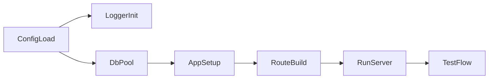

# Build Your First Rustycog Service (Beginner Guide)

This guide is a practical, beginner-first continuation of:

- `Manifesto/docs/rustycog-implementation-and-usage-guide.md`
- `Manifesto/docs/rustycog-hexagonal-web-service-guide.md`

The goal is simple: help you build your own service with the core Rustycog crates you asked for:

- `rustycog-config`
- `rustycog-http`
- `rustycog-logger`
- `rustycog-db`
- `rustycog-testing`

Everything here is based on working patterns already used in this repository (`Manifesto`, `IAMRusty`, `Hive`, `Telegraph`).

## 1) What you are building

You are building a service that:

1. loads typed configuration,
2. initializes logging,
3. opens a DB pool with read/write support,
4. wires command handlers into `AppState`,
5. exposes HTTP endpoints with auth/permissions,
6. validates behavior with integration tests.



## 2) Recommended service structure

Use this shape (same family as existing services):

- `your_service/configuration` - typed config and loader
- `your_service/domain` - entities, value objects, ports
- `your_service/application` - commands, handlers, use cases
- `your_service/infra` - repository implementations, external adapters
- `your_service/http` - routes and handlers
- `your_service/setup` - composition root (`Application::new(...)`)
- `your_service/tests` - integration tests and fixtures
- `your_service/src/main.rs` - load config, init app, run server

If you are new, implement one vertical slice first:

- one command,
- one repository,
- one route,
- one integration test.

## 3) `rustycog-config`: load typed config correctly

`rustycog-config` is your base layer. Everything else depends on it.

### 3.1 Define your config struct

Pattern used in `Manifesto`:

```rust
use serde::{Deserialize, Serialize};
use rustycog_config::{
    ConfigLoader, ConfigError, ServerConfig, LoggingConfig, DatabaseConfig, QueueConfig,
    HasServerConfig, HasLoggingConfig, HasDbConfig, HasQueueConfig, load_config_fresh,
};
pub use rustycog_logger::setup_logging;

#[derive(Debug, Clone, Serialize, Deserialize)]
pub struct MyServiceConfig {
    #[serde(default)]
    pub server: ServerConfig,
    #[serde(default)]
    pub logging: LoggingConfig,
    #[serde(default)]
    pub database: DatabaseConfig,
    #[serde(default)]
    pub queue: QueueConfig,
}

impl Default for MyServiceConfig {
    fn default() -> Self {
        Self {
            server: ServerConfig::default(),
            logging: LoggingConfig::default(),
            database: DatabaseConfig::default(),
            queue: QueueConfig::default(),
        }
    }
}

impl ConfigLoader<MyServiceConfig> for MyServiceConfig {
    fn create_default() -> MyServiceConfig {
        MyServiceConfig::default()
    }

    fn config_prefix() -> &'static str {
        "MYSERVICE"
    }
}

impl HasServerConfig for MyServiceConfig {
    fn server_config(&self) -> &ServerConfig { &self.server }
    fn set_server_config(&mut self, config: ServerConfig) { self.server = config; }
}

impl HasLoggingConfig for MyServiceConfig {
    fn logging_config(&self) -> &LoggingConfig { &self.logging }
    fn set_logging_config(&mut self, config: LoggingConfig) { self.logging = config; }
}

impl HasDbConfig for MyServiceConfig {
    fn db_config(&self) -> &DatabaseConfig { &self.database }
    fn set_db_config(&mut self, config: DatabaseConfig) { self.database = config; }
}

impl HasQueueConfig for MyServiceConfig {
    fn queue_config(&self) -> &QueueConfig { &self.queue }
    fn set_queue_config(&mut self, config: QueueConfig) { self.queue = config; }
}

pub fn load_config() -> Result<MyServiceConfig, ConfigError> {
    load_config_fresh::<MyServiceConfig>()
}
```

### 3.2 File selection (`RUN_ENV`) and overrides

Current loader behavior from `rustycog-config`:

- `RUN_ENV=test` -> loads `config/test.toml`
- `RUN_ENV=production` -> loads `config/production.toml`
- otherwise -> loads `config/development.toml`

Important: `config/default.toml` exists in some services, but with current implementation it is not automatically merged as a base by default loader flow.

### 3.3 Environment variable format (critical)

Use:

- prefix from `config_prefix()`, and
- double underscore for nested fields.

PowerShell example:

```powershell
$env:RUN_ENV="development"
$env:MYSERVICE_SERVER__HOST="127.0.0.1"
$env:MYSERVICE_SERVER__PORT="8085"
$env:MYSERVICE_DATABASE__HOST="localhost"
$env:MYSERVICE_DATABASE__DB="my_service_dev"
$env:MYSERVICE_DATABASE__CREDS__USERNAME="postgres"
$env:MYSERVICE_DATABASE__CREDS__PASSWORD="postgres"
```

### 3.4 Minimal `config/development.toml`

```toml
[server]
host = "127.0.0.1"
port = 8085
tls_enabled = false

[database]
host = "localhost"
port = 5432
db = "my_service_dev"
read_replicas = []
[database.creds]
username = "postgres"
password = "postgres"

[logging]
level = "debug"
```

### 3.5 Other loading helpers you can use later

`rustycog-config` also provides:

- `load_config_with_cache::<T, C>()` when you want config caching,
- `load_config_part::<T>("section_name")` for tests/tools that only need one config section.

Use these only when needed. For a first service, `load_config_fresh::<YourConfig>()` is usually enough.

## 4) `rustycog-logger`: initialize logging once

`rustycog-logger` provides `setup_logging(&config)` and expects your config to satisfy `ServiceLoggerConfig` (which is built on `HasLoggingConfig`).

### 4.1 Use in `main.rs`

```rust
use anyhow::Result;
use my_service_configuration::load_config;
use my_service_setup::Application;
use rustycog_logger::setup_logging;

#[tokio::main]
async fn main() -> Result<()> {
    let config = load_config()?;
    setup_logging(&config);

    let server_config = config.server.clone();
    let app = Application::new(config).await?;
    app.run(server_config).await?;

    Ok(())
}
```

### 4.2 Good to know

- `setup_logging` uses `try_init()`, so repeated init attempts will not panic (useful in tests).
- Logging level is a string (`trace`, `debug`, `info`, `warn`, `error`).
- If you enable `scaleway-loki` feature, config must also support `HasScalewayConfig`.

## 5) `rustycog-db`: create pool and wire repositories

`DbConnectionPool` gives you:

- one write connection (`get_write_connection()`),
- read connection selection (`get_read_connection()`), round-robin across replicas.

### 5.1 Setup in composition root

Pattern from `Manifesto/setup/src/app.rs`:

```rust
use rustycog_db::DbConnectionPool;

async fn setup_database(config: &MyServiceConfig) -> Result<DbConnectionPool, anyhow::Error> {
    let db_pool = DbConnectionPool::new(&config.database).await?;
    Ok(db_pool)
}
```

### 5.2 Repository wiring pattern (read/write split)

```rust
let my_read_repo = Arc::new(MyReadRepositoryImpl::new(db.get_read_connection()));
let my_write_repo = Arc::new(MyWriteRepositoryImpl::new(db.get_write_connection()));

let my_repo = Arc::new(MyRepositoryImpl::new(
    my_read_repo.clone(),
    my_write_repo.clone(),
));
```

### 5.3 Repository implementation template

```rust
pub struct MyReadRepositoryImpl {
    db: Arc<sea_orm::DatabaseConnection>,
}

impl MyReadRepositoryImpl {
    pub fn new(db: Arc<sea_orm::DatabaseConnection>) -> Self {
        Self { db }
    }
}

#[async_trait::async_trait]
impl MyReadRepository for MyReadRepositoryImpl {
    async fn find_by_id(&self, id: uuid::Uuid) -> Result<Option<MyEntity>, DomainError> {
        let model = MySeaOrmEntity::find_by_id(id)
            .one(self.db.as_ref())
            .await
            .map_err(map_db_error)?;

        Ok(model.map(map_model_to_domain))
    }
}
```

### 5.4 Common DB mistakes

- Using write connection for reads everywhere (loses read scaling).
- Using read connection for writes (can fail or misroute writes).
- Forgetting `.as_ref()` when SeaORM expects `&DatabaseConnection`.
- Creating multiple pools instead of cloning one pool instance.
- Wrong config shape for database credentials nesting.

### 5.5 Quick DB verification

Before wiring every repository, verify pool creation works:

1. start the service with valid DB config,
2. call `/health`,
3. hit one endpoint that performs a read,
4. hit one endpoint that performs a write.

If reads and writes both succeed, your connection split/wiring is likely correct.

## 6) Bridge layer: command service and app state

Even though this guide focuses on five crates, you still need command wiring for HTTP handlers to execute use cases.

Pattern:

```rust
let command_registry = MyCommandRegistryFactory::create_registry(my_usecase);
let command_service = Arc::new(GenericCommandService::new(Arc::new(command_registry)));
let user_id_extractor = UserIdExtractor::new();
let state = AppState::new(command_service, user_id_extractor);
```

Your command factory details are covered in:

- `Manifesto/docs/rustycog-implementation-and-usage-guide.md`

## 7) `rustycog-http`: routes, auth, permission, handlers

`rustycog-http` provides:

- `AppState`
- `RouteBuilder`
- extractors (`AuthUser`, `OptionalAuthUser`, `ValidatedJson`)

### 7.1 Minimal routes

```rust
use rustycog_config::ServerConfig;
use rustycog_http::{AppState, RouteBuilder};

pub async fn create_app_routes(state: AppState, config: ServerConfig) -> anyhow::Result<()> {
    RouteBuilder::new(state)
        .health_check()
        .get("/api/ping", ping_handler)
            .authenticated()
        .build(config)
        .await
}
```

### 7.2 Auth patterns

Required auth route:

```rust
.get("/api/me", get_me)
    .authenticated()
```

Handler signature:

```rust
pub async fn get_me(
    axum::extract::State(state): axum::extract::State<AppState>,
    auth_user: rustycog_http::AuthUser,
) -> Result<axum::Json<serde_json::Value>, HttpError> {
    let _ctx = rustycog_command::CommandContext::new().with_user_id(auth_user.user_id);
    Ok(axum::Json(serde_json::json!({ "user_id": auth_user.user_id })))
}
```

Optional auth route:

```rust
.get("/api/projects/{project_id}", get_project)
    .might_be_authenticated()
```

Handler signature:

```rust
pub async fn get_project(
    axum::extract::State(state): axum::extract::State<AppState>,
    auth_user: rustycog_http::OptionalAuthUser,
) -> Result<axum::Json<ProjectResponse>, HttpError> {
    let mut context = rustycog_command::CommandContext::new();
    if let Some(user_id) = auth_user.user_id() {
        context = context.with_user_id(user_id);
    }

    // execute command with or without user context
    // let result = state.command_service.execute(command, context).await?;
    let _ = state;
    let _ = context;
    todo!()
}
```

### 7.3 Validation with `ValidatedJson`

```rust
use serde::Deserialize;
use validator::Validate;
use rustycog_http::ValidatedJson;

#[derive(Debug, Deserialize, Validate)]
pub struct CreateThingRequest {
    #[validate(length(min = 1, max = 120))]
    pub name: String,
}

pub async fn create_thing(
    axum::extract::State(state): axum::extract::State<AppState>,
    auth_user: rustycog_http::AuthUser,
    ValidatedJson(request): ValidatedJson<CreateThingRequest>,
) -> Result<(axum::http::StatusCode, axum::Json<ThingResponse>), HttpError> {
    let context = rustycog_command::CommandContext::new().with_user_id(auth_user.user_id);
    // execute command...
    let _ = state;
    let _ = request;
    let _ = context;
    todo!()
}
```

### 7.4 Permission wiring (must be complete)

Pattern used in `Manifesto/http/src/lib.rs`:

```rust
use rustycog_permission::{Permission, PermissionsFetcher};
use std::sync::Arc;

pub async fn create_app_routes(
    state: AppState,
    config: ServerConfig,
    project_permission_fetcher: Arc<dyn PermissionsFetcher>,
) -> anyhow::Result<()> {
    RouteBuilder::new(state)
        .health_check()
        .permissions_dir(std::path::Path::new("resources/permissions").to_path_buf())
        .resource("project")
        .with_permission_fetcher(project_permission_fetcher)
        .get("/api/projects/{project_id}", get_project)
            .might_be_authenticated()
            .with_permission(Permission::Read)
        .put("/api/projects/{project_id}", update_project)
            .authenticated()
            .with_permission(Permission::Write)
        .build(config)
        .await
}
```

Without `permissions_dir`, `resource`, and `with_permission_fetcher`, guarded routes can panic at runtime.

### 7.5 Common HTTP mistakes

- Using `AuthUser` in handlers for routes marked `.might_be_authenticated()`.
- Calling `.with_permission(...)` before resource/fetcher setup.
- Missing permission model files in `resources/permissions`.
- Assuming middleware order does not matter; auth should be attached before permission checks on the same route chain.

## 8) `rustycog-testing`: reliable integration tests

`rustycog-testing` gives you:

- `ServiceTestDescriptor`
- `TestFixture` (DB/SQS harness)
- `setup_test_server(...)`
- helpers like `http::jwt::create_jwt_token(...)`

### 8.1 Create a test descriptor

Pattern from `Manifesto/tests/common.rs`:

```rust
pub struct MyServiceTestDescriptor;

#[async_trait::async_trait]
impl ServiceTestDescriptor<TestFixture> for MyServiceTestDescriptor {
    type Config = MyServiceConfig;

    async fn build_app(&self, _config: MyServiceConfig, _server_config: ServerConfig) -> anyhow::Result<()> {
        Ok(())
    }

    async fn run_app(&self, config: MyServiceConfig, server_config: ServerConfig) -> anyhow::Result<()> {
        build_and_run(config, server_config, None).await
    }

    async fn run_migrations_up(&self, connection: &sea_orm::DatabaseConnection) -> anyhow::Result<()> {
        Migrator::up(connection, None).await?;
        Ok(())
    }

    async fn run_migrations_down(&self, connection: &sea_orm::DatabaseConnection) -> anyhow::Result<()> {
        Migrator::down(connection, None).await?;
        Ok(())
    }

    fn has_db(&self) -> bool { true }
    fn has_sqs(&self) -> bool { false }
}
```

### 8.2 Setup test server

```rust
pub async fn setup_test_server() -> Result<(TestFixture, String, reqwest::Client), Box<dyn std::error::Error>> {
    let descriptor = std::sync::Arc::new(MyServiceTestDescriptor);
    let fixture = TestFixture::new(descriptor.clone()).await?;
    let (base_url, client) =
        rustycog_testing::setup_test_server::<MyServiceTestDescriptor, TestFixture>(descriptor).await?;
    Ok((fixture, base_url, client))
}
```

### 8.3 JWT helper in tests

```rust
fn create_test_jwt_token(user_id: uuid::Uuid) -> String {
    rustycog_testing::http::jwt::create_jwt_token(user_id)
}
```

Use it in requests:

```rust
let token = create_test_jwt_token(user_id);
let response = client
    .post(&format!("{}/api/things", base_url))
    .header("Authorization", format!("Bearer {}", token))
    .json(&serde_json::json!({ "name": "first" }))
    .send()
    .await?;
```

### 8.4 Seeding test data

Repository fixtures in this repo use builder patterns (`DbFixtures::...` then `.commit(...)`), for example in:

- `Manifesto/tests/fixtures`
- `IAMRusty/tests/fixtures`

For beginners, keep it simple:

1. create owner/user fixture,
2. create parent resource fixture,
3. call endpoint under test,
4. assert status + payload.

### 8.5 Testing event publication

You have two common options:

1. mock publisher assertions (fast, unit/integration hybrid),
2. queue-backed integration (`TestSqsFixture` or `TestKafkaFixture`) for end-to-end event checks.

Mock path example pattern:

```rust
let descriptor = Arc::new(MyDescriptorWithMockEvents::new());
let (_fixture, base_url, client) = setup_test_server_with_mock_events().await?;

// call endpoint...

assert!(descriptor.mock_event_publisher.has_user_signed_up_event());
```

Queue-backed path example pattern:

```rust
let sqs_fixture = rustycog_testing::TestSqsFixture::new().await?;

// perform action that should publish

let messages = sqs_fixture.sqs.get_all_messages(3).await?;
assert!(!messages.is_empty());
```

Start with mock publisher assertions. Add queue-backed tests only for critical integration paths.

### 8.6 Common testing mistakes

- Not setting `RUN_ENV=test` before running integration tests.
- Forgetting to seed authorization context (owner/admin member fixture) before permission-protected calls.
- Asserting only status code without checking body shape and key fields.
- Reusing generated IDs inconsistently between fixture creation and request payload.

## 9) End-to-end checklist (copy this)

Use this as your first-service completion list:

- [ ] Config crate compiles and `load_config()` returns typed config.
- [ ] `RUN_ENV` and env overrides work locally.
- [ ] `setup_logging(&config)` is called once at startup.
- [ ] DB pool initializes (`DbConnectionPool::new(...)`).
- [ ] One read repo + one write repo are wired and used.
- [ ] Command is registered in factory and executable from handler.
- [ ] Route is exposed with correct auth mode.
- [ ] If permission-guarded: `permissions_dir` + `resource` + fetcher are present.
- [ ] Integration test boots server, authenticates with test JWT, and validates behavior.

## 10) Troubleshooting by crate

### `rustycog-config`

Problem: values not loaded from env.  
Check:

- prefix from `config_prefix()` is correct,
- nested keys use `__`,
- `RUN_ENV` points to expected profile.

### `rustycog-logger`

Problem: logs missing or wrong level.  
Check:

- `setup_logging` is called after config load,
- `logging.level` is a supported string,
- test environment may initialize logging earlier (safe due `try_init`).

### `rustycog-db`

Problem: SeaORM type mismatch.  
Check:

- use `self.db.as_ref()` when query APIs expect references.

Problem: read scaling not happening.  
Check:

- reads use `get_read_connection()`,
- `read_replicas` config is set correctly.

### `rustycog-http`

Problem: route panics when adding permissions.  
Check:

- `.permissions_dir(...)` called and path exists,
- `.resource("...")` called for current route group,
- `.with_permission_fetcher(...)` provided before `.with_permission(...)`.

Problem: auth extractor mismatch.  
Check:

- `.authenticated()` routes use `AuthUser`,
- `.might_be_authenticated()` routes use `OptionalAuthUser`.

### `rustycog-testing`

Problem: test server starts but DB assertions fail.  
Check:

- descriptor migrations run in `run_migrations_up`,
- fixture created with `TestFixture::new(...)`,
- you seed required fixtures before making request.

Problem: flaky auth tests.  
Check:

- Authorization header contains `Bearer <token>`,
- token built with `create_jwt_token`.

## 11) Minimal command snippets to remember

Run service in dev:

```powershell
$env:RUN_ENV="development"
cargo run -p your-service-package
```

Run tests:

```powershell
$env:RUN_ENV="test"
cargo test -p your-service-package
```

Check health:

```powershell
Invoke-WebRequest -Uri "http://127.0.0.1:8085/health" -UseBasicParsing
```

---

If you follow this sequence exactly, you will have a working baseline service with predictable config, observable logs, safe DB wiring, secure HTTP middleware, and integration tests you can trust.
