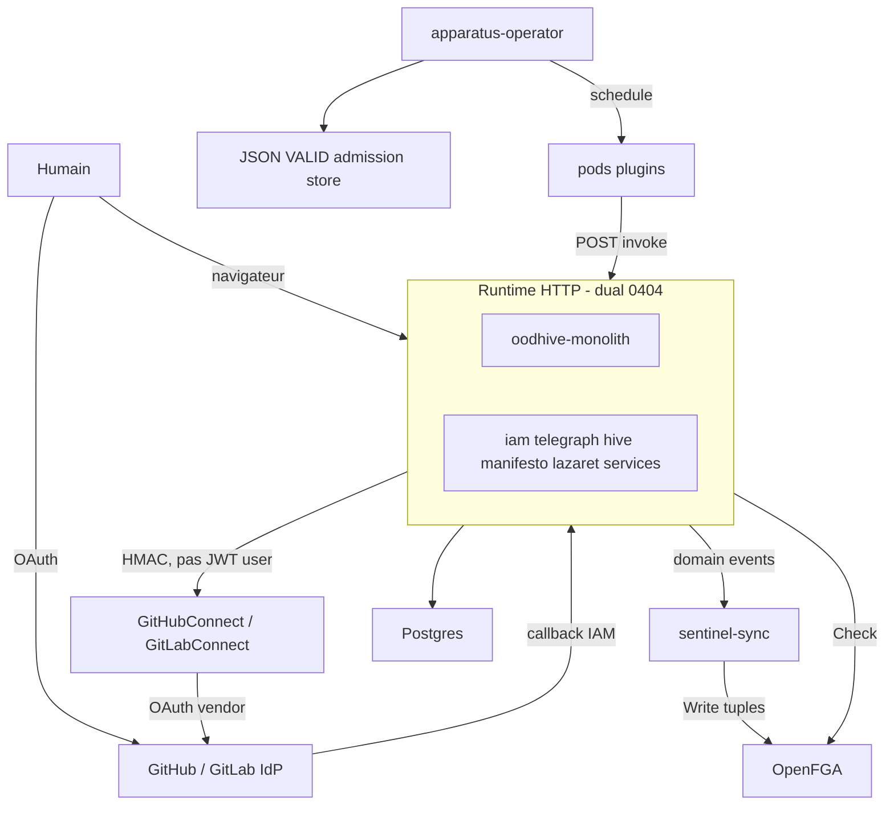

# Atlas d’architecture

Handbook visuel : comment le dépôt **réel** s’articule (monolithe, IAM, Hive, Manifesto, Lazaret, Apparatus, permissions). Canon = ADR + code. **Le code gagne** si un texte ADR est en retard. Le wiki Obsidian reste la couche conception ; les diagrammes vivent ici.

Recettes d’implémentation (ports, TOML, JWT) : [../README.md](../README.md). Décisions : [../adr/README.md](../adr/README.md).

## Légende — Statut vs Réalité

Deux axes indépendants ([règle ADR](../adr/README.md)) :

| Axe | Valeurs | Lecture |
|---|---|---|
| **Statut** (ADR) | `Proposed` / `Accepted` / … | La cible est-elle ratifiée ? |
| **Réalité** (badge de page) | `Implemented` / `Partial` / `Proposed` | Le dépôt réalise-t-il le dessin ? |

`Accepted` n’autorise pas à dessiner une cible comme livrée. Un badge **Proposed** (souvent `Unimplemented` dans l’ADR) = non shipped. Ne pas confondre avec le Statut ADR `Proposed`.

## Diagrammes

| Page | Sujet | Réalité |
|---|---|---|
| [runtime.md](runtime.md) | Dual runtime : un listener vs cinq binaires | Implemented |
| [authn-authz.md](authn-authz.md) | AuthN JWT puis AuthZ OpenFGA | Implemented |
| [permissions.md](permissions.md) | Org, projet, membership SQL, tuples | Implemented |
| [apparatus-lazaret.md](apparatus-lazaret.md) | Admission, operator, invoke gateway | Implemented |
| [topology.md](topology.md) | kind local vs cible cluster | Partial |
| [events.md](events.md) | Contrats `*-events`, outbox, Telegraph | Partial |

## Contexte (C4)

**Réalité : Partial** — acteurs HTTP et workers **Implemented** ; le cluster portable (GKE, Flux, OTLP) n’est **pas** dessiné ici, voir [topology.md](topology.md).

L’humain atteint **soit** le monolithe (`/iam` … `/lazaret`), **soit** les cinq standalones — mêmes contrats de chemins, deux plaques de binaires. Les connecteurs IdP et `sentinel-sync` ne sont pas nestés dans `oodhive-monolith`. L’operator (hors Manifesto / Lazaret) isole le plugin ; le plugin ne parle à la plateforme que via Lazaret. L’attestation `VALID` vit dans un store JSON (`APPARATUS_ADMISSION_STORE_PATH`), pas dans Postgres.

## Sources ADR

| ID | Décision | Statut | Réalité |
|---|---|---|---|
| [0404](../adr/0404-runtime-microservices-et-monolithe.md) | Dual runtime standalones + monolithe | Accepted | Implemented |
| [0400](../adr/0400-iamrusty-identite-hexagonale.md) | IAM = IdP, pas OpenFGA | Accepted | Implemented |
| [0408](../adr/0408-connecteurs-idp-services-http.md) | Connecteurs HTTP, pas de nest monolithe | Accepted | Implemented |
| [0303](../adr/0303-sentinel-sync-worker-fga.md) | Worker événements → tuples | Accepted | Implemented |
| [0008](../adr/0008-apparatus-p4-k8s-isolation-outside-manifesto.md) | Isolation K8s hors Manifesto | Accepted | Implemented |
