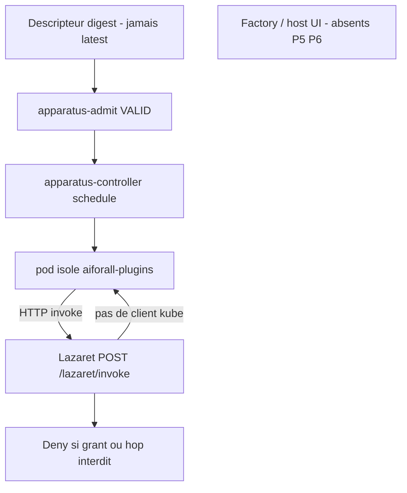

# Apparatus et Lazaret

**Réalité : Implemented** pour le chemin dessiné (contrats, admission `VALID`, operator, gateway Lazaret). **Factory / host UI absents** (P5/P6) — non dessinés comme livrés. Binding catalogue : [0001](../adr/0001-apparatus-binding-owned-by-manifesto.md) reste **Partial**.

Identité d’installation = digest du descripteur canonique ([0002](../adr/0002-apparatus-contract-first.md)), pas un tag `latest`. Seul l’admission worker (`apparatus-admit`) atteste `VALID` ; `VERIFIED` est un signal éditorial distinct ([0005](../adr/0005-apparatus-same-protocol-valid-verified.md)). Le ticker P2 ([0006](../adr/0006-apparatus-p2-reconciliation-in-process.md)) reste in-process Manifesto ; le moteur d’isolation livré est P4 operator + Jobs, **hors** Manifesto et **hors** Lazaret ([0008](../adr/0008-apparatus-p4-k8s-isolation-outside-manifesto.md)).

Le plugin est untrusted ([0003](../adr/0003-apparatus-untrusted-plugin.md)) : toute I/O passe par Lazaret ([0004](../adr/0004-apparatus-capability-gateway.md), [0007](../adr/0007-apparatus-p3-capability-boundary-after-accept.md)). `POST /lazaret/invoke` décide au grant (principal DB ∩ ACL) ; le locator de hop **ne parle pas à kube** (`PluginEndpointLocator` — commentaire dans `Lazaret/application/src/invoke.rs`). Hop interdit ou grant deny → pas d’invoke.

Index : [README.md](README.md) · [runtime.md](runtime.md) · [topology.md](topology.md).

## Sources ADR

| ID | Décision | Statut | Réalité |
|---|---|---|---|
| [0001](../adr/0001-apparatus-binding-owned-by-manifesto.md) | Binding = extension ProjectComponent | Accepted | Partial |
| [0002](../adr/0002-apparatus-contract-first.md) | Contrats et digest avant Factory | Accepted | Implemented |
| [0003](../adr/0003-apparatus-untrusted-plugin.md) | Plugin hors processus privilégiés | Accepted | Implemented |
| [0004](../adr/0004-apparatus-capability-gateway.md) | I/O via gateway ; KV plateforme | Accepted | Implemented |
| [0005](../adr/0005-apparatus-same-protocol-valid-verified.md) | VALID ≠ VERIFIED ≠ installable | Accepted | Implemented |
| [0006](../adr/0006-apparatus-p2-reconciliation-in-process.md) | Réconciliation P2 in-process Manifesto | Accepted | Implemented |
| [0007](../adr/0007-apparatus-p3-capability-boundary-after-accept.md) | Gateway = bounded context Lazaret | Accepted | Implemented |
| [0008](../adr/0008-apparatus-p4-k8s-isolation-outside-manifesto.md) | Operator + Jobs, isolation K8s | Accepted | Implemented |
