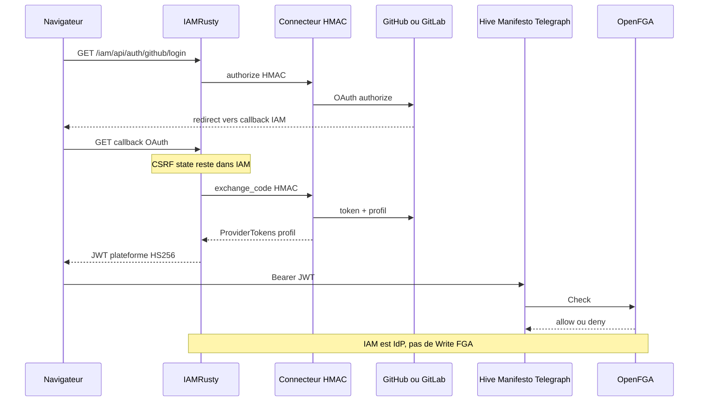

# AuthN puis AuthZ

**Réalité : Implemented** — IAM émet le JWT plateforme ; Hive / Manifesto / Telegraph font le Check OpenFGA. IAM **n’écrit pas** les tuples.

Le navigateur ne frappe **jamais** le connecteur : callback, CSRF et linking restent IAM ([0409](../adr/0409-confiance-callback-oauth-idp-connect.md)). Le connecteur détient `client_secret` et parle au vendor ; IAM l’appelle en HMAC-SHA256 (`X-IdP-Connect-Timestamp` / `X-IdP-Connect-Signature`), sans bearer utilisateur. Slug provider fail-closed ([0411](../adr/0411-idp-provider-slug-registry-fail-closed.md)). Le schéma utilise le nest monolithe `/iam` ; le contrat IAM standalone est `/api/auth/{provider}/login` (même suffixe, sans préfixe).

Côté métier : rustycog-http vérifie `iss=iamrusty` / `aud=aiforall`. L’AuthZ instance = OpenFGA (`with_permission_on`). IAM compose un `InMemoryPermissionChecker` : IdP, pas PDP ([0302](../adr/0302-authn-jwt-authz-openfga.md), [0400](../adr/0400-iamrusty-identite-hexagonale.md)).

Index : [README.md](README.md) · suite : [permissions.md](permissions.md).

## Sources ADR

| ID | Décision | Statut | Réalité |
|---|---|---|---|
| [0302](../adr/0302-authn-jwt-authz-openfga.md) | JWT HS256 ; OpenFGA réelle en IT | Accepted | Implemented |
| [0400](../adr/0400-iamrusty-identite-hexagonale.md) | IAM = IdP hexagonal, pas FGA | Accepted | Implemented |
| [0407](../adr/0407-contrat-authn-federee-vendor-neutral.md) | Contrat fédéré vendor-neutral | Accepted | Implemented |
| [0408](../adr/0408-connecteurs-idp-services-http.md) | Connecteurs = services HTTP | Accepted | Implemented |
| [0409](../adr/0409-confiance-callback-oauth-idp-connect.md) | Callback IAM ; secrets + OAuth = connecteur | Accepted | Implemented |
| [0410](../adr/0410-migration-iam-connecteurs-idp.md) | Routes `/api/auth/{provider}` conservées | Accepted | Implemented |
| [0411](../adr/0411-idp-provider-slug-registry-fail-closed.md) | Registry boot fail-closed | Accepted | Implemented |
