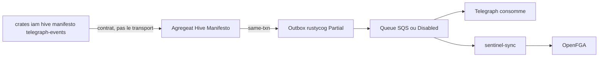

# Événements

**Réalité : Partial** — crates contrat **Implemented** ; outbox transactionnel **Partial** ; Telegraph consomme, sans outbox propre.

Les crates `*-events` sont le **contrat** (types / enveloppes), pas le bus ([0300](../adr/0300-crates-events-contrat-sans-transport.md)). `QueueConfig` : `Sqs` | `Kafka` | `Disabled` (files opt-in). `apparatus-events` existe sur disque mais n’est **pas** `workspace.members`.

Publication durable = outbox rustycog ([0301](../adr/0301-outbox-transactionnel-rustycog.md)) : Hive/Manifesto visent la même transaction que l’agrégat ; IAM enregistre dans une transaction **séparée** ; Telegraph n’a pas d’outbox (consommateur `notification_created`). Telegraph reste event-driven, HTTP étroit ([0403](../adr/0403-telegraph-notifications-event-driven.md)).

Cette page ferme la carte applicative. Cloud / OTLP : [topology.md](topology.md), pas ici.

Index : [README.md](README.md) · [permissions.md](permissions.md).

## Sources ADR

| ID | Décision | Statut | Réalité |
|---|---|---|---|
| [0300](../adr/0300-crates-events-contrat-sans-transport.md) | `*-events` = contrat | Accepted | Implemented |
| [0301](../adr/0301-outbox-transactionnel-rustycog.md) | Publication durable = outbox | Accepted | Partial |
| [0403](../adr/0403-telegraph-notifications-event-driven.md) | Telegraph event-driven, HTTP étroit | Accepted | Implemented |
| [0303](../adr/0303-sentinel-sync-worker-fga.md) | Projection FGA hors hexagone | Accepted | Implemented |
