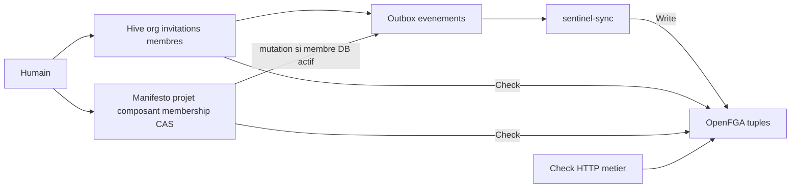

# Organisations, projets, permissions

**Réalité : Implemented** — membership projet = vérité SQL ; OpenFGA = PDP alimenté par `sentinel-sync`, pas un Write résiduel dans Manifesto.

Hive possède organisations, invitations et membres ([0402](../adr/0402-hive-organisations.md)). Manifesto possède projets, composants, `project_members`, grants et CAS `projects.revision` : une mutation AuthZ prend un verrou, incrémente, 409 si conflit. L’ACL SQL et l’outbox partagent la **même** transaction ([0401](../adr/0401-manifesto-projets-composants-acl-cas.md)). Une tuple FGA orpheline ne suffit pas : il faut un membership **actif en base**.

`sentinel-sync` n’est pas un hexagone : consumer + translators Hive / Manifesto / IAM / Telegraph → Write OpenFGA ([0303](../adr/0303-sentinel-sync-worker-fga.md)). Hors Compose par défaut ; hôte : `just sentinel-sync` après `just up-infra` et `just monolith`. IAM publie des events identité mais n’écrit toujours pas les tuples org/projet.

Index : [README.md](README.md) · [authn-authz.md](authn-authz.md) · [events.md](events.md).

## Sources ADR

| ID | Décision | Statut | Réalité |
|---|---|---|---|
| [0401](../adr/0401-manifesto-projets-composants-acl-cas.md) | Projet, membership SQL, CAS, ACL+outbox | Accepted | Implemented |
| [0402](../adr/0402-hive-organisations.md) | Organisations, invitations, membres | Accepted | Implemented |
| [0303](../adr/0303-sentinel-sync-worker-fga.md) | Worker événements → tuples | Accepted | Implemented |
| [0302](../adr/0302-authn-jwt-authz-openfga.md) | Check OpenFGA en service | Accepted | Implemented |
| [0400](../adr/0400-iamrusty-identite-hexagonale.md) | IAM n’écrit pas les tuples métier | Accepted | Implemented |
