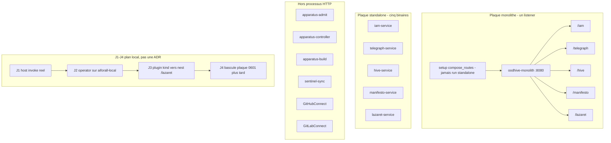

# Dual runtime

**Réalité : Implemented** — `oodhive-monolith` et les cinq `*-service` existent. Hors processus HTTP : operator, `sentinel-sync`, connecteurs IdP.

**Écart ADR vs code :** [0404](../adr/0404-runtime-microservices-et-monolithe.md) parle encore de **quatre** préfixes (`/iam`, `/telegraph`, `/hive`, `/manifesto`) et omet `lazaret-service`. Le code prime : [`monolith/src/routes.rs`](../../monolith/src/routes.rs) neste **cinq** `SERVICE_PREFIX`, y compris `/lazaret`. On ne réécrit pas le corps de 0404 ici.

Le monolithe charge les **setup** (`monolith/src/runtime.rs`) puis `compose_routes` : un `serve_router`, des background tasks agrégées, `/health` + `/ready`. Il n’appelle jamais `run()` d’un service. Les standalones restent le défaut Compose (`iam-service` … `lazaret-service`). Connecteurs IdP : standalones Compose seulement, **pas** de nest monolithe ([0408](../adr/0408-connecteurs-idp-services-http.md)).

La séquence J1–J4 est un **ordre de livraison** laptop/kind ([plan](../platform-local-monolith-kind-implementation-plan.md)), pas une ADR : elle ne SuperSède pas 0404 ni 0601.

Index : [README.md](README.md) · suite : [authn-authz.md](authn-authz.md), [topology.md](topology.md).

## Sources ADR

| ID | Décision | Statut | Réalité |
|---|---|---|---|
| [0404](../adr/0404-runtime-microservices-et-monolithe.md) | Dual runtime ; monolithe ≠ successeur | Accepted | Implemented |
| [0405](../adr/0405-readiness-crate-partagee.md) | `/ready` partagée | Accepted | Implemented |
| [0408](../adr/0408-connecteurs-idp-services-http.md) | Connecteurs hors monolithe | Accepted | Implemented |
| [0008](../adr/0008-apparatus-p4-k8s-isolation-outside-manifesto.md) | Operator / Jobs, pas de nest HTTP | Accepted | Implemented |
| [0303](../adr/0303-sentinel-sync-worker-fga.md) | Worker, pas un routeur | Accepted | Implemented |
