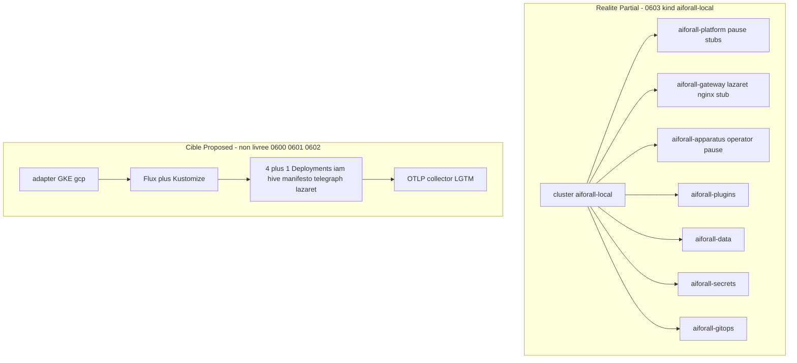

# Où ça tourne

**Réalité : Partial** — kind `aiforall-local` + manifests `deploy/` ([0603](../adr/0603-tranche-locale-deploy-kind-apparatus-lazaret.md) Proposed / Partial). La cible 4+1 Deployments, GKE, Flux et OTLP est **Proposed / Unimplemented** : dessinée à part, **pas** comme livrée.

0603 livre les arbres `deploy/` + `cloud/opentofu/` et une preuve YAML Apparatus↔Lazaret (namespaces `aiforall-*`, stubs `pause` / nginx). Ce n’est **pas** GKE, **pas** Flux live, **pas** 0602 (`aiforall-obs` volontairement hors M1). Le cluster IT `apparatus-p4-it` (preuve 0008) n’est **pas** `aiforall-local`.

0601 fige l’unité cluster V1 = **4+1** Deployments dans les mêmes noms de namespaces, **sans** tenancy par ns et **sans** Deployment monolithe canon. 0600/0602 (OpenTofu jusqu’au cluster, image digest, câble OTLP) restent une cible : ne pas les coller sur un `kubectl get` kind actuel.

J3 ([0604](../adr/0604-j3-overlay-demo-monolith-kind-invoke.md) Proposed) : overlay **démo séparé** `deploy/apps/overlays/kind-demo-monolith/` (`oodhive-monolith` + `host.docker.internal`). Ce n’est **pas** un SuperSéde de 0601 ; `overlays/kind` (M2 nginx) reste la preuve stub 0603.

Index : [README.md](README.md) · [runtime.md](runtime.md) · [apparatus-lazaret.md](apparatus-lazaret.md).

## Sources ADR

| ID | Décision | Statut | Réalité |
|---|---|---|---|
| [0603](../adr/0603-tranche-locale-deploy-kind-apparatus-lazaret.md) | Tranche locale A+B, pas GKE ni 0602 | Proposed | Partial |
| [0601](../adr/0601-cluster-trust-namespaces-standalones.md) | 4+1 Deployments, ns `aiforall-*` | Proposed | Unimplemented |
| [0600](../adr/0600-cloud-portable-opentofu-k8s-gitops.md) | Compose / kind / remote ; GKE ; Flux | Proposed | Unimplemented |
| [0602](../adr/0602-observabilite-portable-otlp-lgtm.md) | Câble OTLP ; LGTM derrière collector | Proposed | Unimplemented |
| [0604](../adr/0604-j3-overlay-demo-monolith-kind-invoke.md) | Overlay kind démo `oodhive-monolith` ; pas SuperSéde 0601 | Proposed | Implemented |
| [0008](../adr/0008-apparatus-p4-k8s-isolation-outside-manifesto.md) | P4 s’insère ici, sans SuperSéder 0600 | Accepted | Implemented |
