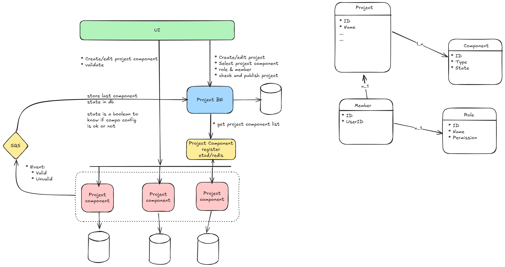
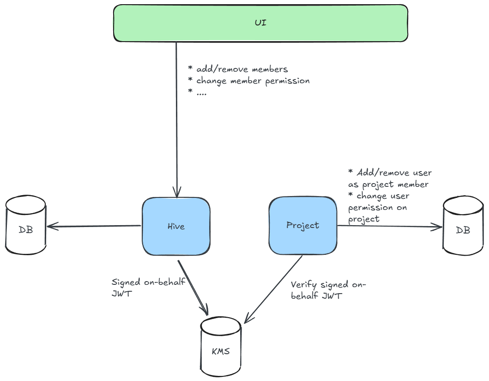
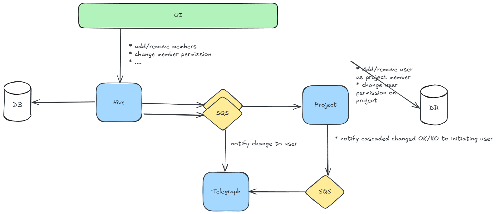

# Project Service Architecture Decision Record

## Overview
This document captures the architectural decisions made for the Project Service ecosystem, including component management, permission strategies, and cross-service orchestration.

## Project Service

### Core Concept
A collaborative platform where users can create customizable projects with pluggable components. Projects can be personal or organizational, with configurable features selected during a multi-step creation process.

### Key Characteristics
- **Multi-step creation workflow**: Definition → Component Selection → Component Configuration → Members & Roles → Publication
- **Draft state management**: Projects can be saved and resumed at any step
- **Modular architecture**: Components are independent services with shared interfaces
- **Permission autonomy**: Each service manages its own resource permissions

---

## Component Services



### What
Independent microservices that provide specific functionality to projects (TaskBoard, Custom Forms, Analytics, etc.). Each component implements a common API contract but provides unique business logic.

### Why
- **Flexibility**: Project creators can select only needed components
- **Scalability**: Components scale independently based on usage
- **Development autonomy**: Teams can develop and deploy components independently
- **Extensibility**: New component types can be added without modifying core services

### Architecture Decisions

#### Registry Pattern
**Decision**: Use Redis as component registry instead of database or configuration files
- **Rationale**: 
  - Dynamic discovery without service restarts
  - Simple key-value operations perfect for registry use case
  - TTL support for health checking
  - Pub/Sub for real-time notifications
- **Implementation**: Components self-register with metadata using `component:{service_identifier}` keys

#### Service Discovery
**Decision**: Kubernetes-based discovery with predictable naming
- **Pattern**: `{service_identifier}.components.svc.cluster.local:8080`
- **Benefits**: Leverages K8s built-in service discovery, predictable URLs, namespace isolation

#### Component Registration
**Decision**: Self-registration on startup via HTTP API to AppLayer
- **Registration responses**: 200 (new), 202 (existing), 4xx/5xx (errors)
- **Registry scope**: Component Services (logical), not instances (physical)
- **Load balancing**: Handled by Kubernetes Service, AppLayer doesn't track instances

#### Common API Contract
**Decision**: Standardized interface across all components
```
GET  /api/v1/manifest     # Component capabilities and metadata
POST /api/v1/configure    # Configure component for project
POST /api/v1/validate     # Validate configuration
POST /api/v1/activate     # Activate component for project
GET  /health              # Health check
```

#### Configuration Storage
**Decision**: Distributed configuration (each component owns its data)
- **Alternative considered**: Centralized in Project Service
- **Rationale**:
  - Service autonomy and domain ownership
  - Performance (local access)
  - Scalability (no central bottleneck)
  - Microservice best practices
- **Trade-off**: Project data scattered across services (mitigated with event-driven sync)

#### Configuration Validation Flow
**Decision**: UI → Component Service (validate & store) → Project Service (update status)
- **Project Service tracks**: Boolean state (configured/not configured) per component
- **Component Services handle**: Detailed validation and storage
- **Benefits**: Domain expertise stays with component, Project Service maintains overall state

---

## Impersonation Service




### What
A **generic orchestration service** that handles cross-domain operations requiring permissions from multiple services. Supports various impersonation entities and operation types through a pluggable architecture.

### Why
**The Bootstrap Problem**: When creating resources on behalf of other entities, permission checking requires the resource to exist, but the resource doesn't exist yet.

**Solution**: Use cryptographically signed JWTs to prove authorization across service boundaries for any entity type and operation.

### Generic Architecture

#### Pluggable Entity System
**Decision**: Support multiple impersonation entity types, not just organizations
- **Current entities**: Organizations
- **Future entities**: Teams, Departments, External Partners, Service Accounts
- **Extensible design**: New entity types can be added without core service changes

#### Task-Based Operations
**Decision**: Generic task system instead of hardcoded operations
- **Current tasks**: 
  - `create_project` (Organization → Project Service)
- **Future tasks**:
  - `invite_user` (Organization → IAM Service)  
  - `manage_billing` (Organization → Billing Service)
  - `deploy_resource` (Team → Infrastructure Service)
  - `access_data` (External Partner → Data Service)

#### Permission Strategy Architecture
**Decision**: Pluggable permission providers per entity type
- **Organization permissions**: Handled by Hive Service
- **Team permissions**: Could be handled by separate Team Service
- **External permissions**: Could integrate with external systems
- **Service permissions**: Could validate against service-specific rules

### Implementation Pattern

#### Generic JWT Structure
```json
{
  "user_id": "uuid",
  "entity_type": "organization|team|department|external_partner",
  "entity_id": "uuid",
  "is_premium_entity": boolean,
  "allowed_tasks": ["create_project", "invite_user", "manage_billing"],
  "constraints": {"max_projects": 10, "budget_limit": 1000},
  "exp": timestamp,
  "iss": "impersonation-service", 
  "aud": "target-service"
}
```

#### Extensible Task Registry
```rust
// Conceptual structure
pub trait ImpersonationTask {
    fn task_name(&self) -> &str;
    fn required_permissions(&self) -> Vec<Permission>;
    fn target_service(&self) -> &str;
    async fn execute(&self, token: JWT, params: TaskParams) -> Result<TaskResult>;
}

// Task implementations
pub struct CreateProjectTask;
pub struct InviteUserTask; 
pub struct ManageBillingTask;
```

#### Entity Provider Pattern
```rust
// Conceptual structure  
pub trait EntityPermissionProvider {
    fn entity_type(&self) -> EntityType;
    async fn check_permission(&self, user_id: Uuid, entity_id: Uuid, task: &str) -> Result<bool>;
    async fn get_constraints(&self, entity_id: Uuid) -> Result<EntityConstraints>;
    async fn sign_token(&self, claims: TokenClaims) -> Result<SignedJWT>;
}

// Provider implementations
pub struct OrganizationProvider; // Delegates to Hive Service
pub struct TeamProvider;         // Delegates to Team Service  
pub struct ExternalProvider;     // Integrates with external systems
```

### Key Management Strategy
**Decision**: Scaleway Key Manager with entity-type-aware key selection
- **Pattern**: `impersonation-{entity_type}-{entity_id/common}-jwt`
- **Examples**: 
  - `impersonation-org-common-jwt` (basic organizations)
  - `impersonation-org-{uuid}-jwt` (premium organizations)
  - `impersonation-team-common-jwt` (all teams)
  - `impersonation-external-{partner_id}-jwt` (external partners)

### Generic Workflow
1. **UI** → **Impersonation Service**: Execute task for entity
2. **Impersonation** → **Entity Provider**: Check permissions for user/entity/task
3. **Entity Provider** → **KMS**: Sign entity-specific JWT  
4. **Impersonation** → **Target Service**: Execute task with signed JWT
5. **Target Service** → **KMS**: Verify JWT signature
6. **Target Service**: Execute operation with entity as owner/context

### Benefits
- **Generic framework**: Supports any entity type and task combination
- **Service autonomy**: No direct coupling between services
- **Extensibility**: New entities and tasks added through configuration
- **Consistent security**: Same cryptographic patterns across all operations
- **Audit trail**: Complete operation history with entity context

---

## Organization Change Cascading



### What
System for propagating organization membership changes to related projects, with user control over cascade behavior.

### Why
- **Data consistency**: Organization and project memberships can diverge over time
- **User experience**: Automatic cleanup when users leave organizations
- **Flexibility**: Not all org changes should cascade (user control required)
- **Async processing**: Cascading shouldn't block primary operations

### Architecture

#### Event-Driven Design
**Decision**: SQS-based async cascade processing
- **Flow**: Hive → SQS → Project Service → SQS → Telegraph (notifications)
- **Benefits**: 
  - Non-blocking UI operations
  - Resilient to failures (retry capabilities)
  - Decoupled services
  - Horizontal scaling

#### User-Controlled Cascading
**Decision**: Cascade is optional, controlled by change initiator
- **UI presents**: Impact preview before cascade
- **User chooses**: Whether to cascade changes to projects
- **Prevents**: Unintended cascading consequences

#### Event Schema
```json
{
  "event_type": "MemberRemoved|PermissionChanged|...",
  "org_id": "uuid",
  "user_id": "uuid", 
  "initiated_by": "uuid",
  "cascade_to_projects": boolean,
  "timestamp": "iso8601"
}
```

#### Conflict Resolution Strategy
**Future consideration**: Handle edge cases like:
- Removing last project owner
- User has higher project permissions than org
- Projects that would become orphaned

### Benefits
- **Eventual consistency**: Organization and project state stay aligned
- **User control**: Prevents unintended consequences
- **Scalability**: Async processing handles large organizations
- **Auditability**: Complete event trail for compliance

---

## Technology Choices

### Core Stack
- **Language**: Rust (performance, safety, ecosystem)
- **Cloud**: Scaleway (European sovereignty, cost-effective)
- **Orchestration**: Kubernetes (Scaleway Kapsule)
- **Message Queue**: SQS (reliable async processing)

### Storage & Security
- **Component Registry**: Redis (managed Scaleway Database for Redis)
- **Component Config**: Distributed (each service owns data)
- **Key Management**: Scaleway Key Manager (EU sovereign, cost-effective)
- **Secret Storage**: Scaleway Secret Manager (integration with KMS)

---

## Decision Rationale Summary

1. **Microservice autonomy** over centralized control
2. **Event-driven architecture** over synchronous coupling  
3. **User control** over automatic behaviors
4. **European sovereignty** over global cloud providers
5. **Cost optimization** over feature-rich solutions
6. **Service-owned data** over centralized databases
7. **Cryptographic authorization** over service-to-service calls
8. **Generic frameworks** over hardcoded solutions

This architecture provides a scalable, secure, and flexible foundation for the collaborative project platform while maintaining clear service boundaries and European data sovereignty.