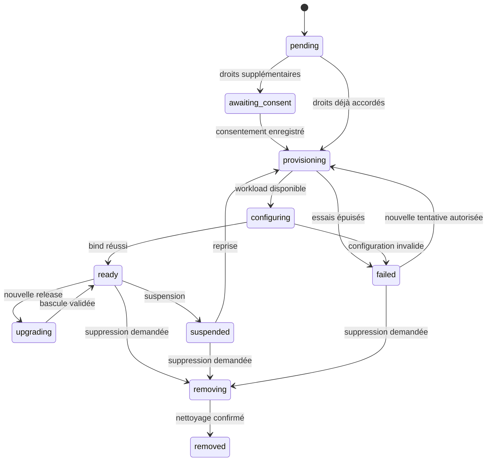

# Apparatus — bindings et cycle de vie

Cette note précise la cible de [[projects/manifesto/concepts/apparatus-platform]]. Le code possède aujourd’hui `ProjectComponent` et un consumer de statuts, pas le contrôleur décrit ci-dessous. Preuves : [[projects/manifesto/references/apparatus-source-reconciliation]].

## Identités et données

Le choix proposé est de conserver la ligne `project_components` et son UUID comme ancre de compatibilité et d’ACL, avec une extension en relation 1:1 contenant le desired state et le statut runtime. On évite de créer un second objet d’autorisation pour la même installation. ^[inferred]

| Objet futur | Identité et champs essentiels |
|---|---|
| Apparatus | `apparatus_id` canonique, publisher propriétaire vérifié, nom, description, état du catalogue |
| Release | `apparatus_id + version` uniques, commit Git résolu, manifeste normalisé, version protocole, digests du descripteur/backend/UI, résultat de conformance, politique de build |
| Binding | `binding_id = component.id`, `project_id`, `desired_release_descriptor_digest` déjà admis, configuration non secrète versionnée, références de secrets, permissions consenties, `grant_revision`, `desired_generation`, état désiré |
| Statut binding | `observed_generation`, `observed_release_digest`, phase, conditions, instance active/candidate, dernier code d’erreur, prochain essai |
| Instance | UUID interne, release exacte, portée d’isolation, adaptateur, handle runtime opaque, lease et état de santé |
| Opération | UUID, binding, génération, type, clé d’idempotence, lease/attempt, résultat durable |

Toutes les lignes de ce tableau sont des propositions de schéma ; les migrations restent à écrire. Ne pas stocker JWT, mot de passe ou contenu de secret dans ces champs. ^[inferred]

L’unicité actuelle `(project_id, component_type)` devient en V1 « un Apparatus canonique par projet ». `component_type` ne contient ni version, ni digest, ni identifiant de pod. Les types historiques doivent être mappés explicitement à un identifiant catalogue ; une entrée inconnue reste legacy, sans déploiement automatique. L’organisation se déduit du projet, jamais d’un champ libre envoyé par un plugin. ^[inferred]

Les releases sont immuables. Le digest désiré est résolu et admis lors de la commande, jamais recalculé depuis un tag pendant la réconciliation. Retirer une release du catalogue empêche une nouvelle installation ; une révocation de sécurité peut aussi suspendre les bindings actifs. Le trust du publisher, la conformité d’une release et l’autorisation de l’installer sont trois états distincts. ^[inferred]

## Desired state et état observé

Proposition : `desired_state = enabled | suspended | removed` ; `phase = pending | awaiting_consent | provisioning | configuring | ready | upgrading | suspended | failed | removing | removed`. La santé (`Ready`, `Degraded`, raison) reste une condition séparée. `ready` exige la bonne génération, la bonne release et un bind/configure abouti ; une liveness HTTP seule ne suffit pas. ^[inferred]

Ce diagramme illustre les chemins usuels ; `removed` doit pouvoir être demandé depuis toute phase non terminale, et un upgrade peut échouer en conservant l’ancienne release active. Les règles exhaustives de transition feront partie du contrat testé. ^[inferred]

## Réconciliation proposée

1. Une commande authentifiée vérifie projet, ACL d’instance, quota et release admise. Dans une transaction, elle écrit le desired state, incrémente `desired_generation`, crée l’opération et l’outbox. Elle retourne `202 Accepted`, l’UUID et une URL de suivi. Pas d’appel Kubernetes dans la transaction. ^[inferred]
2. Le worker reçoit une notification, puis relit la DB comme source de vérité. Un scan périodique des opérations dues récupère les notifications perdues. Une lease par binding et un fencing token évitent deux décisions concurrentes. ^[inferred]
3. L’adaptateur réalise `ensure_instance`, `observe_instance`, `bind/configure`, `unbind`, `delete_instance`. Les clés d’opération et labels dérivent du binding et de la génération, pas du hasard d’un retry. Une ressource créée avant un crash doit être retrouvée. ^[inferred]
4. Le worker enregistre le résultat par compare-and-swap sur génération et lease, puis publie l’observation via outbox. Une observation d’une ancienne génération ne peut pas écraser la nouvelle. ^[inferred]
5. Retries exponentiels bornés avec jitter pour timeout/indisponibilité ; manifeste invalide, permission refusée ou migration incompatible sont des erreurs terminales nécessitant une correction. Conserver `next_retry_at`, code d’erreur et corrélation ; ne pas mettre des secrets dans les erreurs. ^[inferred]

Pas de promesse « exactly once » : transport au moins une fois et effets idempotents. Une tentative `bind` doit pouvoir être rejouée sans recréer une ressource externe ; les opérations ayant des effets externes doivent définir leur clé d’idempotence et leur politique de compensation. ^[inferred]

Le consommateur actuel recherche par `project_id + component_type`, compare `old_status`, ignore doublons/statuts périmés et conserve `changed_at`. Ce mécanisme protège certaines transitions, mais ne distingue pas les générations d’installation ni un cycle ABA. Il ne remplace pas la lease et le fencing proposés.

## Événements et autorisation

Conserver `ComponentAdded` et `ComponentRemoved` pour le lien `component:{id}#project@project:{project_id}` et la compatibilité sentinel-sync. Ajouter des événements versionnés propres au desired state et aux observations, portant au minimum `event_id`, `binding_id`, `project_id`, génération, opération, release et date. Le contrôleur de confiance les émet ; le plugin ne peut pas publier arbitrairement sur les queues internes. ^[inferred]

Les écritures de lifecycle ne créent pas de nouvel ACL. `ProjectAuthorizationUnitOfWork` sait déjà persister les mutations d’ajout/retrait avec ACL et outbox ; réutiliser cette frontière, puis une UoW sans changement d’ACL pour les observations. Ne pas assimiler la révision monotone AuthZ du projet à la génération runtime du binding. ^[inferred]

Le consumer `apparatus-events` historique reste limité aux installations legacy pendant la migration. Les nouveaux bindings gérés n’acceptent pas ses messages non corrélés à leur génération ; un ancien événement `active` ne doit pas réactiver un binding supprimé. ^[inferred]

Voir [[projects/manifesto/references/manifesto-event-model]], [[projects/sentinel-sync/concepts/manifesto-transport-and-ledger]] et [[projects/manifesto/concepts/component-instance-permissions]].

## Statut historique et compatibilité

`Pending / Configured / Active / Disabled` reste une projection destinée aux anciennes API. Le modèle runtime distinct porte les échecs, retries et suppressions. Ne pas forcer une transition interdite par l’enum actuelle pour y représenter une phase nouvelle ; fournir les nouveaux champs sur des DTO additifs et traiter explicitement la transition legacy. ^[inferred]

Pour l’API future, conserver le préfixe `/manifesto/api`. Des routes `/projects/{id}/apparatus-bindings`, `/{binding_id}/operations` et `/{binding_id}/invoke` sont des noms candidats, pas des routes existantes. Les clients actuels de `/components` doivent garder leur comportement pendant la migration. ^[inferred]

## Configuration, upgrade et rollback

- Configuration non secrète validée par le schéma de la release ; secret stocké via référence. Chaque modification produit une nouvelle génération, une autorisation et un audit. Les migrations s’exécutent avec une capacité de stockage limitée au binding. ^[inferred]
- Upgrade explicitement demandé vers un digest ; calculer le delta de permissions avant tout déploiement. Consentement absent : `awaiting_consent`, ancienne release maintenue selon sa politique. ^[inferred]
- Préparer une instance candidate, exécuter conformance/readiness et migration compatible, puis basculer atomiquement le pointeur de routage. Retirer les droits et l’instance précédents après drainage. Pour une migration incompatible, prévoir une fenêtre d’indisponibilité explicite. ^[inferred]
- Rollback de code seulement si les données restent compatibles. Conserver dans l’historique digest de release, version de configuration et version de schéma de données. La V1 doit imposer des migrations ascendantes compatibles ou une sauvegarde/restauration testée avant changement destructif ; conserver l’ancien digest ne restaure pas les données. ^[inferred]
- Un Apparatus partagé ne pourrait pas être mis à jour au gré d’un seul projet. Le futur pool devra au minimum être partitionné par release, isolation, configuration compatible et politique de droits ; raison supplémentaire pour une V1 par projet. ^[inferred]

## Désactivation et suppression

Dès une suspension, révocation ou suppression, le gateway refuse les nouvelles invocations à partir du desired state en DB ; il n’attend pas une suppression Kubernetes ni une projection OpenFGA. Invalider `grant_revision`, fermer les canaux UI, drainer les appels en cours selon leur contrat. Un effet externe déjà accepté ne peut pas être annulé par simple révocation. ^[inferred]

La désinstallation enregistre d’abord un tombstone durable, puis exécute unbind, sauvegarde/purge selon politique, libération des secrets et destruction de l’instance. Les données conservées pendant la rétention restent inaccessibles au plugin. Échec du nettoyage : état `removing` visible, retries et alerte, pas de faux succès. ^[inferred]

La FK actuelle de `project_components` supprime les lignes en cascade avec le projet. Il faut donc, **avant d’activer les workloads**, modifier le chemin de suppression du projet pour enregistrer une intention de nettoyage indépendante de cette cascade. Un inventaire périodique des ressources portant des labels plateforme traite les orphelins. L’API peut annoncer la suppression logique tout en exposant un statut de nettoyage. ^[inferred]

La politique proposée pour l’archivage est la suspension et la conservation des données. La durée de rétention, la purge définitive et l’éventuel transfert d’organisation restent des arbitrages produit identifiés dans [[projects/manifesto/references/apparatus-implementation-plan]]. ^[inferred]
