# Apparatus — plateforme d’extensions future

> [!important] Proposition, pas fonctionnalité livrée
> Le document utilisateur exprime une intention produit. Le code du dépôt fait foi pour l’existant. Ce dossier reste le **rationnel de conception**. Les invariants de la vague 1 sont ADR **Accepted** ([[projects/manifesto/decisions/index]]) avec `Réalité` **Partial**. P0 (contrats + KV de référence) est dans [[projects/manifesto/concepts/apparatus-p0-contracts]] ; P1 (persistance Manifesto, non commité) dans [[projects/manifesto/concepts/apparatus-p1-persistence]] ; Factory, contrôleur, gateway réseau et host UI restent absents.

Un **Apparatus** apporte une capacité fonctionnelle à un projet : Git, wiki, kanban, CI ou outil spécialisé. Officiels et communautaires utilisent le même contrat. Le développeur fournit du Rust, éventuellement une interface statique, un manifeste et un dépôt Git ; la plateforme prend en charge la construction, la distribution et l’exécution. Ces exigences viennent du document fourni.

La base actuelle est [[projects/manifesto/concepts/component-based-project-orchestration]] : Manifesto sait attacher un `ProjectComponent`, contrôler ses droits et recevoir des changements de statut. Il ne possède pas encore la Factory, le catalogue versionné, le contrôleur de workloads ni le host UI décrits ici. La photographie technique et les preuves sont dans [[projects/manifesto/references/apparatus-source-reconciliation]].

## Parcours de lecture

| Note | Ce qu’elle tranche ou prépare |
|---|---|
| [[projects/manifesto/references/apparatus-source-reconciliation]] | Écarts source/code, vocabulaire réel, références et limites de l’audit |
| [[projects/manifesto/concepts/apparatus-bindings-and-lifecycle]] | Identités, données, contrôleur, concurrence, événements, suppression et upgrades |
| [[projects/manifesto/concepts/apparatus-capabilities-and-isolation]] | Autorisations, identité de workload, stockage, secrets, réseau et isolation |
| [[projects/manifesto/references/apparatus-factory-and-distribution]] | Manifeste, Git → OCI, builders, provenance et admission |
| [[projects/manifesto/references/apparatus-ui-and-protocol]] | Host à créer, contrats SDK, iframe, handshake et contributions |
| [[projects/manifesto/decisions/index]] | ADR Accepted (identité, contrats, confiance, gateway) et réalité d’implémentation |
| [[projects/manifesto/concepts/apparatus-p0-contracts]] | Crates P0 livrées (validateur, digest, harness, KV de référence) |
| [[projects/manifesto/concepts/apparatus-p1-persistence]] | Persistance P1 (extension 1:1, backfill, T1-T7) |
| [[projects/manifesto/references/apparatus-implementation-plan]] | Migration par étapes, tests d’acceptation et arbitrages restants |

## Responsabilités proposées

Les frontières suivantes sont des choix de conception pour la future plateforme. Une frontière de sécurité impose parfois un processus séparé ; un module métier n’impose pas automatiquement un nouveau microservice. ^[inferred]

| Élément | Responsabilité | Exécution proposée |
|---|---|---|
| IAMRusty | Identités des utilisateurs et validation de leur session | Service actuel ou monolithe |
| Hive | Organisations, appartenance et droits organisationnels | Service actuel ou monolithe |
| Manifesto | Projets/composants actuels ; catalogue métier, releases, bindings et consentements futurs | Modules à créer dans le service actuel |
| Contrôleur Apparatus | Réconcilier le desired state avec l’état observé, allouer les instances | Worker plateforme ; privilèges runtime isolés des handlers HTTP |
| Runtime adapter | Créer/observer/supprimer des workloads, exposer un routage interne | Adaptateur de production à décider dans `APP-01` ; adaptateur de développement contrôlé |
| Capability gateway | Autoriser chaque opération, filtrer les données, résoudre le binding et les secrets | Composant plateforme de confiance, jamais code d’Apparatus |
| Factory | Construire du code hostile, tester puis soumettre un résultat candidat | Workers éphémères séparés ; publication/signature hors workers |
| Registry OCI | Conserver blobs, manifestes, attestations et signatures | Infrastructure séparée du catalogue |
| Host UI | Mise en page, installation, état des bindings, SDK bridge, rendu schema | Application cliente à créer |
| Apparatus backend/UI | Logique propre à l’extension, sous capacités explicites | Hors processus des services de confiance |
| sentinel-sync | Projection des droits vers OpenFGA | Pipeline existant à conserver |
| Telegraph | Notifications produit ciblées : installation terminée, intervention nécessaire | Service actuel ; ne devient ni bus de lifecycle ni orchestrateur |

Le [[projects/aiforall/references/modular-monolith-runtime]] doit continuer de fonctionner. Le monolithe peut composer les API de contrôle, mais ne charge pas le Rust communautaire dans son processus. Un Apparatus reste un workload distant dans les deux modes. ^[inferred]

```mermaid
flowchart LR
    Dev["Dépôt Git + commit"] --> Factory["Factory isolée"]
    Factory --> Admission["Conformance et admission"]
    Admission --> Registry["Registry OCI : digests"]
    Registry --> Catalog["Catalogue de releases"]
    User["Utilisateur"] --> Host["Host UI"]
    Host --> API["Manifesto : binding + consentement"]
    Catalog --> API
    API --> DB["DB + outbox"]
    DB --> Controller["Contrôleur"]
    Controller --> Runtime["Runtime adapter"]
    Runtime --> Plugin["Backend Apparatus"]
    Host --> Frame["UI sandboxée"]
    Frame --> Bridge["Bridge host"]
    Bridge --> Gateway["Capability gateway"]
    Plugin --> Gateway
    Gateway --> Services["API Manifesto / Hive / Telegraph"]
```

## V1 recommandée

Les restrictions de V1 réduisent les mécanismes à prouver sans supprimer la vision du document. ^[inferred]

- Managed seulement ; Rust natif construit par un builder plateforme figé ; frontend absent, schema, ou bundle statique Vite.
- Isolation **par projet et binding** pour le code tiers. Le manifeste peut exprimer les modes supportés, mais l’opérateur décide du mode effectif. Le partage entre projets attend une preuve d’isolation des données, secrets, sessions et ressources.
- Une installation du même Apparatus par projet, conformément à l’unicité actuelle de `project_components`. Plusieurs versions peuvent coexister entre projets.
- Digest et consentement figés au niveau du binding ; aucune mise à jour automatique de code ou de permissions.
- SDK identique pour tous les publishers ; `VERIFIED` ne contourne aucune frontière.
- Slots `project.tab`, `project.settings` et `project.overview.widget` seulement. Les slots organisation/globaux nécessitent un modèle d’installation et d’autorisation distinct.
- Adaptateur de production et moteur d’isolation à trancher dans `APP-01` ; Kubernetes reste une piste documentée, pas une décision de la vague 1.
- Stockage persistant via API plateforme, filesystem du workload jetable ; voir [[projects/manifesto/concepts/apparatus-capabilities-and-isolation]].

## Évolutions conservées

Le document conserve comme directions : builders statiques supplémentaires, modes `organization` et `shared`, scale-to-zero, runtimes WASM/WASI, services externes, marketplace et composants UI intégrés de confiance. Elles restent hors V1. OSB, Operators, Artifact Hub, Knative, Dapr et Crossplane sont des inspirations ou pistes, pas des dépendances requises. ^[inferred]

Les interfaces doivent donc séparer `release`, `binding`, `instance` et `runtime`. Un runtime WASM pourra implémenter les mêmes opérations fonctionnelles sans garantir qu’un binaire Rust natif existant soit compatible sans recompilation. ^[inferred]

## Critère de réussite

Un développeur soumet un commit d’un Apparatus de référence ; la plateforme construit une release immuable. Un utilisateur autorisé consent aux permissions, crée un binding, observe sa disponibilité et utilise son UI. Réessais, redémarrage du contrôleur, révocation et suppression sont vérifiés sans fuite entre projets. Ce scénario, détaillé dans [[projects/manifesto/references/apparatus-implementation-plan]], constitue la cible de livraison proposée. ^[inferred]

## Connexions à l’existant

- [[projects/manifesto/manifesto]] — service propriétaire du projet.
- [[projects/manifesto/concepts/component-instance-permissions]] — conserver les droits par instance.
- [[projects/manifesto/concepts/immediate-membership-acl]] — l’état DB des membres reste décisif.
- [[projects/aiforall/roadmap]] — inscription de cette fonctionnalité future.
