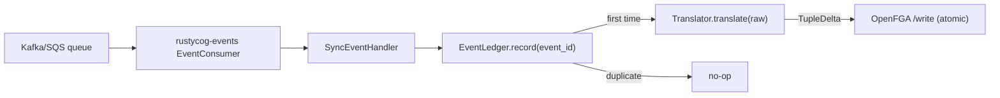

# Sentinel Sync Worker

`sentinel-sync` is a Rust binary (crate `sentinel-sync/`) that bridges the existing event bus to the centralized OpenFGA store.

## Layout

- `main.rs` — boots logging, loads config, builds the OpenFGA write client, the idempotency ledger, the translator list, and the concrete event consumer; waits on SIGINT.
- `lib.rs` — public library surface for tests (`canonical_event_envelope`, reconcile, translators).
- `idempotency.rs` — `EventLedger` plus `InMemoryEventLedger` and `PostgresEventLedger`. Manifesto revisions must be `> last`.
- `fga_client.rs` — Write plus store-wide Read used by reconcile (`read_manifesto_tuples`).
- `config.rs` — `SentinelSyncConfig` (`SENTINEL_SYNC__*`).
- `handler.rs` — envelope, ledger, translators.
- `translator/` — hive, manifesto, iam.

## Data flow



## Configuration

```toml
[openfga]
scheme = "http"
host = "localhost"
port = 8080
store_id = "01HX..."
authorization_model_id = "01HX..."   # optional
api_token = "..."                    # optional

[idempotency]
backend = "in-memory"                # or "postgres" (planned)

[queue]
kind = "kafka"                       # shared RustyCog QueueConfig
# ...
```

Sample file: [sentinel-sync/config/sentinel-sync.toml.example](../../../../sentinel-sync/config/sentinel-sync.toml.example).

The split `scheme` / `host` / `port` shape mirrors service OpenFGA config and supports `port = 0` for testcontainer-backed runs. When tests boot `sentinel-sync` beside [[projects/rustycog/references/openfga-real-testcontainer-fixture]], the fixture publishes `SENTINEL_SYNC_OPENFGA__SCHEME`, `HOST`, `PORT`, `STORE_ID`, and `AUTHORIZATION_MODEL_ID` so the worker writes tuples into the same fresh OpenFGA store as the service under test.

## Idempotency

`SyncEventHandler` begins a ledger row, canonicalizes the envelope, translates, writes OpenFGA, then completes. Duplicates skip. A failed OpenFGA write **fails** the row (retryable). An undecodable **Manifesto** event type also fails, not complete. Details: [[projects/sentinel-sync/concepts/manifesto-transport-and-ledger]].

## Translators

Each translator decodes the raw JSON into the service's `DomainEvent` enum. Decoding failure yields `None` unless the type is Manifesto — then the handler errors. Empty deltas are valid. Incomplete v1 Manifesto destructives are empty on purpose.

The concrete event-to-tuple mappings live in [[projects/sentinel-sync/references/event-to-tuple-mapping]].

## Related

- [[projects/sentinel-sync/sentinel-sync]]
- [[projects/sentinel-sync/references/openfga-model]]
- [[projects/sentinel-sync/references/event-to-tuple-mapping]]
- [[projects/rustycog/references/openfga-real-testcontainer-fixture]]
- [[concepts/openfga-as-authorization-engine]]
- [[entities/relation-tuple]]
